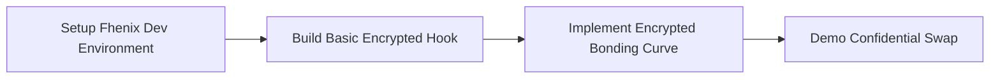
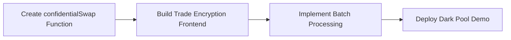
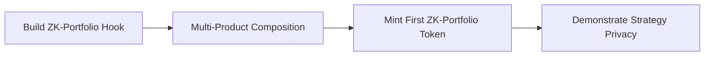
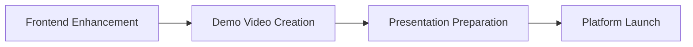

# Chimera: The Future of Confidential DeFi


## 🚀 Project Vision

**Chimera** is the first-ever platform for creating, trading, and composing **proprietary financial strategies** on a public blockchain. By combining Uniswap V4's programmable hooks with Fhenix's confidential computing, Chimera transforms traditional AMMs into sophisticated financial engineering platforms while preserving intellectual property and eliminating MEV exploitation.

### The Revolutionary Promise

> *Transform Uniswap from a fully transparent market into a dual-sided exchange supporting both public pools and on-chain "dark pools" for financial derivatives.*

---

## 🎯 Core Innovation: The Trifecta

Chimera introduces three groundbreaking innovations that work in perfect synergy:

### 1. 🔐 **Encrypted Alpha Hook** - Intellectual Property Protection
**Problem:** Hedge funds and quants won't enter DeFi because their million-dollar algorithms would be instantly copied.
**Solution:** Financial strategies with encrypted parameters using Fhenix's fhEVM.

### 2. 🌑 **Dark Pool Trading** - MEV-Resistant Order Flow
**Problem:** All AMM trades are public, enabling front-running and sandwich attacks.
**Solution:** Confidential order batching that processes encrypted trading intents.

### 3. 📂 **ZK-Portfolio Weaver** - Confidential Strategy Composition
**Problem:** Even with private products, wallet watching can reveal overall strategies.
**Solution:** Zero-knowledge portfolio tokens with encrypted asset composition.

---

## 🏗️ Architecture Overview

```
┌─────────────────────────────────────────────────────────────┐
│                     Chimera Platform                        │
├─────────────────────┬─────────────────────┬─────────────────┤
│ Financial Engineering│   Fhenix Confidential│  Uniswap V4     │
│ Hook (FEH)          │   Computing Layer    │  Integration    │
└─────────────────────┴─────────────────────┴─────────────────┘
```

### Core Components

#### 🧮 **Financial Engineering Hook (FEH)**
- **Custom Curve Hook**: Replaces x*y=k with arbitrary mathematical functions (Linear, Exponential, Sigmoid, Logarithmic, Polynomial)
- **Encrypted Alpha Hook**: Main hook for confidential strategy deployment with encrypted parameters
- **Dynamic Risk & Time Module**: Volatility-based fees, automated time decay, and leverage controls
- **LP Position Underwriting**: LPs become conscious derivative underwriters with asymmetric provision

#### 🔒 **Fhenix Integration**
- **Encrypted Parameters**: Critical strategy parameters stored as `Fhe<uint>`
- **Confidential Computation**: Operations performed on encrypted data
- **Privacy-Preserving Execution**: No parameter leakage to validators or observers

---

## 🎪 Revolutionary Use Cases

### 🏦 **1. Institutional Alpha Protection**
**Scenario:** A hedge fund has a proprietary volatility strategy worth $50M in development costs.

**Traditional Problem:** Deploying on-chain = instant IP theft
**Chimera Solution:** 
- Strategy parameters encrypted with Fhenix
- Computation happens on encrypted values
- Fund earns fees while protecting trade secrets
- **Result:** First-ever on-chain hedge fund with invisible strategies

### 💹 **2. Oracle-Free Derivatives Market**
**Scenario:** Creating ETH call options without price oracles.

**Traditional Problem:** Oracle dependencies, liquidation risks, complex protocols
**Chimera Solution:**
- Sigmoid bonding curve with encrypted strike price
- Self-discovering option pricing through AMM mechanics
- Automated time decay via on-chain theta
- **Result:** Native DeFi options that just work™

### 🛡️ **3. MEV-Resistant Trading**
**Scenario:** Large trader wants to execute without front-running.

**Traditional Problem:** Public mempool enables sandwich attacks
**Chimera Solution:**
- Encrypted trade intents submitted to dark pool
- Confidential batch processing within Fhenix environment
- Unified price execution eliminates arbitrage opportunities
- **Result:** Institutional-grade trade execution protection

### 🧩 **4. Confidential Portfolio Management**
**Scenario:** Creating complex multi-leg strategies without revealing composition.

**Traditional Problem:** Wallet watching reveals strategy components
**Chimera Solution:**
- ZK-Portfolio Weaver composes assets confidentially
- Output token has encrypted composition weights
- Strategy remains opaque while being fully tradeable
- **Result:** On-chain portfolio management with TradFi-level privacy

---

## 🔄 Implementation Flow

### Phase 1: Foundation (Week 1)


### Phase 2: Dark Pool (Week 2)


### Phase 3: Strategy Weaver (Week 3)


### Phase 4: Polish & Launch (Week 4)


---

## 💡 Technical Deep Dive

### Encrypted Alpha Hook Implementation

```solidity
contract EncryptedAlphaHook {
    // Encrypted parameters using Fhenix
    mapping(PoolId => FheUint64) private encryptedStrike;
    mapping(PoolId => FheUint64) private encryptedLeverage;
    mapping(PoolId => FheBytes32) private encryptedFormula;
    
    function calculatePrice(
        PoolId poolId, 
        uint256 reserves
    ) internal view returns (uint256) {
        // Perform computation on encrypted values
        FheUint64 price = computeConfidential(
            reserves,
            encryptedStrike[poolId],
            encryptedLeverage[poolId]
        );
        return price.decrypt(); // Only final result is revealed
    }
}
```

### Dark Pool Trade Flow

```solidity
function confidentialSwap(
    PoolId poolId,
    bytes calldata encryptedIntent
) external {
    // Decrypt intent within Fhenix environment
    SwapParams memory params = decryptSwapIntent(encryptedIntent);
    
    // Process within confidential execution
    uint256 amountOut = executeConfidentialSwap(poolId, params);
    
    // Send tokens to user
    token.transfer(msg.sender, amountOut);
}
```

### ZK-Portfolio Composition

```solidity
contract ZKPortfolioWeaver {
    struct EncryptedPortfolio {
        FheUint64[] weights;    // Hidden allocation weights
        address[] assets;       // Public asset addresses
        FheBytes32 strategy;    // Hidden strategy identifier
    }
    
    function composeStrategy(
        bytes[] calldata encryptedWeights,
        address[] calldata assets
    ) external returns (uint256 portfolioTokenId) {
        // Confidentially allocate across multiple pools
        // Return opaque portfolio token
    }
}
```

---

## 🎯 Competitive Advantages

| Feature | Traditional DeFi | Chimera |
|---------|------------------|---------|
| **Strategy Privacy** | ❌ Fully transparent | ✅ Encrypted parameters |
| **MEV Protection** | ❌ Public mempool exposure | ✅ Confidential execution |
| **Oracle Dependency** | ❌ External price feeds | ✅ Self-discovering prices |
| **IP Protection** | ❌ Instant copying | ✅ Cryptographic secrecy |
| **Institutional Grade** | ❌ Toy protocols | ✅ TradFi-level sophistication |

---

## 📊 Market Impact

### Target Users
- **🏛️ Hedge Funds**: Deploy alpha strategies without IP theft
- **🧠 Quantitative Traders**: Monetize proprietary models on-chain
- **🏢 Institutional Investors**: Access sophisticated products with privacy
- **💰 DeFi Users**: Trade without MEV exploitation
- **🔬 Strategy Developers**: Build and sell financial engineering tools

### Market Size
- **DeFi TVL**: $100B+ (immediate addressable market)
- **Hedge Fund AUM**: $4.5T (TradFi migration opportunity)
- **Derivatives Market**: $600T+ (long-term total addressable market)

---

## 🛣️ Roadmap

### 🎯 **Immediate (Hackathon)**
- [ ] Core encrypted hook implementation
- [ ] Dark pool MVP with batch processing
- [ ] ZK-Portfolio weaver prototype
- [ ] Comprehensive demo and presentation

### 🚀 **Phase 1 (Post-Hackathon)**
- [ ] Mainnet deployment on Fhenix
- [ ] Advanced curve library expansion
- [ ] Institutional partnership program
- [ ] Developer SDK release

### 🌟 **Phase 2 (6 Months)**
- [ ] Cross-chain strategy deployment
- [ ] Advanced portfolio management tools
- [ ] Institutional custody integration
- [ ] Regulatory compliance framework

### 🏛️ **Phase 3 (1 Year)**
- [ ] Full TradFi product suite
- [ ] Institutional market making
- [ ] Strategy marketplace
- [ ] Global financial institution adoption

---

## 🔧 Getting Started

### Prerequisites
```bash
# Install Fhenix development environment
npm install -g @fhenixprotocol/fhenix-cli

# Clone Uniswap V4 core
git clone https://github.com/Uniswap/v4-core

# Install dependencies
npm install
```

### Quick Start
```bash
# Deploy basic encrypted hook
npx fhenix deploy EncryptedAlphaHook

# Run dark pool demo
npm run demo:darkpool

# Launch frontend
npm run dev
```

---

## 🤝 Contributing

We're building the future of finance. Join us:

1. **🔬 Research**: Help design new financial products
2. **💻 Development**: Contribute to core protocol
3. **🎨 Frontend**: Build intuitive user interfaces
4. **📚 Documentation**: Improve developer experience
5. **🧪 Testing**: Ensure protocol security

---

## 📜 License

MIT License - Building open financial infrastructure for everyone.

---

## 🌐 Links

- **🏠 Website**: [chimera.finance](https://chimera.finance)
- **📖 Documentation**: [docs.chimera.finance](https://docs.chimera.finance)
- **💬 Discord**: [discord.gg/chimera](https://discord.gg/chimera)
- **🐦 Twitter**: [@ChimeraFinance](https://twitter.com/ChimeraFinance)
- **📧 Contact**: team@chimera.finance

---

**Built with ❤️ by the Chimera Team**

*Transforming DeFi from transparent markets into sophisticated financial engineering platforms while preserving privacy and preventing value extraction.*

---

## 🎬 Demo Videos

### 🔥 Core Features Demo
- **Encrypted Alpha Strategy**: See a hedge fund deploy their proprietary volatility model
- **Dark Pool Trading**: Watch MEV-resistant trade execution in action  
- **ZK-Portfolio Creation**: Witness the first confidential portfolio composition

### 🏛️ Institutional Use Case
- **Hedge Fund Onboarding**: Complete flow from strategy development to deployment
- **Risk Management**: Real-time confidential position monitoring
- **Performance Analytics**: Private strategy performance tracking

---

*Ready to revolutionize finance? Let's build Chimera together.* 🚀
