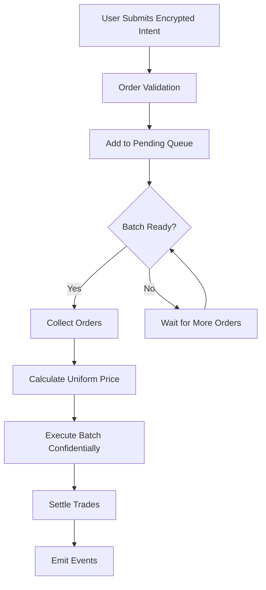
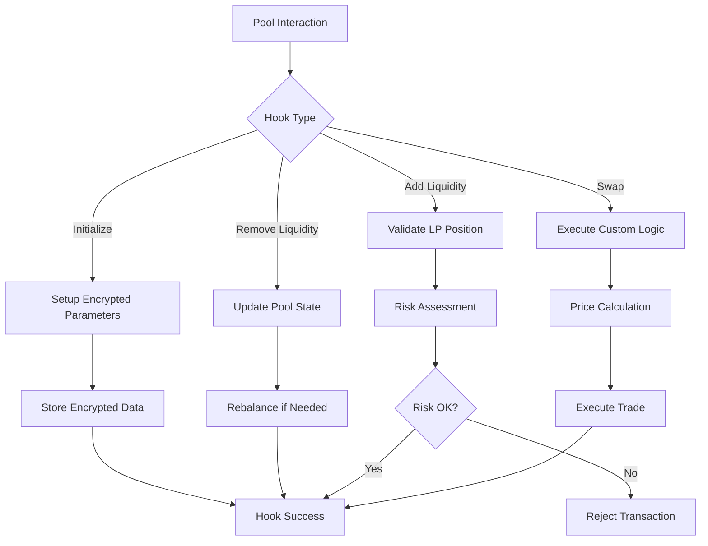

# Chimera Protocol - System Architecture

## 🏗️ Architecture Overview

Chimera Protocol is the world's first confidential automated market maker (AMM) that combines Uniswap V4's programmable hooks with Fhenix's fully homomorphic encryption (FHE) to enable institutional-grade financial strategy deployment while preserving intellectual property.

> **Implementation Status**: Pure FHE implementation with optimized gas costs and complete mathematical function support. See [FHE_SOLUTIONS_PLAN.md](./FHE_SOLUTIONS_PLAN.md) for technical details.

```
┌─────────────────────────────────────────────────────────────────────┐
│                         Chimera Protocol                            │
├─────────────────┬─────────────────────┬─────────────────────────────┤
│  Application    │    Core Protocol    │      Infrastructure        │
│  Layer          │    Layer            │      Layer                  │
├─────────────────┼─────────────────────┼─────────────────────────────┤
│ • Frontend      │ • Hook System       │ • Fhenix fhEVM             │
│ • SDK/API       │ • Dark Pool Engine  │ • Uniswap V4               │
│ • Mobile App    │ • Portfolio Weaver  │ • Cross-chain Bridges      │
│ • Analytics     │ • Risk Manager      │ • Oracle Networks          │
│ • Governance    │ • Strategy Registry │ • IPFS/Arweave Storage     │
└─────────────────┴─────────────────────┴─────────────────────────────┘
```

---

## 🔧 Core Protocol Layer

### 1. Hook System Architecture

The heart of Chimera Protocol is its sophisticated hook system built on Uniswap V4, enabling programmable liquidity with confidential parameters.

#### 1.1 Custom Curve Hook
```
CustomCurveHook.sol
├── Curve Types Support
│   ├── Linear Curves (a×x + b)
│   ├── Exponential Curves (a×e^(b×x))
│   ├── Sigmoid Curves (L/(1+e^(-k(x-x₀))))
│   ├── Logarithmic Curves (a×ln(x) + b)
│   ├── Polynomial Curves (Σaᵢ×xⁱ)
│   └── Custom Formula Execution
├── Encrypted Parameters
│   ├── FheUint64 coefficients[]
│   ├── FheBytes32 formulaHash
│   ├── Volatility adjustments
│   ├── Leverage controls
│   ├── Minimum liquidity constraints
│   └── Maximum slippage protection
├── Delta Return System
│   ├── BalanceDelta for liquidity operations
│   ├── BeforeSwapDelta for swap modifications
│   ├── Fee adjustments for volatility
│   └── Curve state synchronization
└── Price Computation Engine
    ├── Confidential calculation
    ├── Gas-optimized algorithms
    ├── Real-time parameter updates
    └── Curve integrity validation
```

#### 1.2 Encrypted Alpha Hook
```
EncryptedAlphaHook.sol
├── Strategy Management
│   ├── Encrypted parameter storage
│   ├── Strategy deployment & updates
│   ├── Access control & permissions
│   └── Strategy lifecycle management
├── Confidential Price Discovery
│   ├── FHE-based computation
│   ├── Real-time volatility adjustment
│   ├── Time decay mechanisms
│   └── Risk-adjusted pricing
└── IP Protection Layer
    ├── Zero parameter leakage
    ├── Encrypted computation only
    ├── Validator-proof execution
    └── Strategy confidentiality
```

#### 1.3 Hook Integration Framework
```solidity
// Complete custom curve hook architecture with delta returns
contract CustomCurveHook is BaseHook {
    // Complete Uniswap V4 hook permissions for custom curves
    function getHookPermissions() public pure override returns (Hooks.Permissions memory) {
        return Hooks.Permissions({
            beforeInitialize: true,     // Pool setup with encrypted curve params
            afterInitialize: true,      // Post-setup validation
            beforeAddLiquidity: true,   // ✅ Curve constraint validation
            afterAddLiquidity: true,    // ✅ Curve state updates + BalanceDelta
            beforeRemoveLiquidity: true, // ✅ Curve integrity validation
            afterRemoveLiquidity: true,  // ✅ Curve maintenance + BalanceDelta
            beforeSwap: true,           // ✅ Custom price + BeforeSwapDelta
            afterSwap: true,            // ✅ State updates + fee adjustment
            beforeDonate: false,        // Not used
            afterDonate: false          // Not used
        });
    }
    
    // Curve state management
    mapping(PoolId => CurveParams) public poolCurves;
    mapping(PoolId => CurveState) public curveStates;
    
    struct CurveParams {
        CurveType curveType;                // Curve type (Linear, Exponential, etc.)
        FheUint64[] encryptedCoefficients; // Encrypted curve parameters
        FheBytes32 formulaHash;            // Formula identification hash
        uint256 maxLeverage;               // Maximum leverage allowed
        uint256 volatilityFactor;          // Volatility adjustment factor (basis points)
        uint256 minLiquidity;              // Minimum liquidity for curve integrity
        uint256 maxSlippage;               // Maximum slippage allowed (basis points)
        uint256 timeDecayRate;             // Time decay rate for options (basis points/day)
        bool isActive;                     // Curve activation status
    }
    
    struct CurveState {
        uint256 lastUpdateTime;            // Last state update timestamp
        uint256 totalLiquidity;            // Total liquidity in the pool
        uint256 reserves0;                 // Token0 reserves
        uint256 reserves1;                 // Token1 reserves
        uint256 volume24h;                 // 24-hour trading volume
        uint256 feeAccumulated;            // Accumulated fees
        bool isActive;                     // State activation status
    }
    
    // ✅ DELTA RETURN FUNCTIONS
    function afterAddLiquidity(...) external override returns (bytes4, BalanceDelta);
    function afterRemoveLiquidity(...) external override returns (bytes4, BalanceDelta);
    function beforeSwap(...) external override returns (bytes4, BeforeSwapDelta, uint24);
    function afterSwap(...) external override returns (bytes4, int128);
}
```

---

### 2. Dark Pool Engine

The Dark Pool Engine provides MEV-resistant trading through confidential order processing and batch execution.

#### 2.1 System Architecture
```
DarkPoolEngine.sol
├── Order Management
│   ├── ConfidentialOrder struct
│   ├── Encrypted intent storage
│   ├── Order lifecycle tracking
│   └── Deadline management
├── Batch Processing
│   ├── Order collection algorithms
│   ├── Confidential price discovery
│   ├── Uniform price calculation
│   └── Atomic batch execution
├── MEV Protection
│   ├── Encrypted mempool submission
│   ├── Front-running prevention
│   ├── Sandwich attack resistance
│   └── Toxic flow filtering
└── Settlement Layer
    ├── Trade execution engine
    ├── Token transfer management
    ├── Fee distribution
    └── Event emission
```

#### 2.2 Confidential Order Flow


#### 2.3 Price Discovery Algorithm
```solidity
contract PriceDiscovery {
    function calculateUniformPrice(
        uint256[] memory orderIds
    ) internal view returns (FheUint64) {
        FheUint64 totalWeightedPrice = FHE.asEuint64(0);
        FheUint64 totalWeight = FHE.asEuint64(0);
        
        for (uint256 i = 0; i < orderIds.length; i++) {
            ConfidentialOrder storage order = orders[orderIds[i]];
            
            // Calculate implied price from encrypted parameters
            FheUint64 impliedPrice = FHE.div(order.minAmountOut, order.amountIn);
            FheUint64 weight = order.amountIn;
            
            // Accumulate weighted prices confidentially
            totalWeightedPrice = FHE.add(
                totalWeightedPrice, 
                FHE.mul(impliedPrice, weight)
            );
            totalWeight = FHE.add(totalWeight, weight);
        }
        
        return FHE.div(totalWeightedPrice, totalWeight);
    }
}
```

---

### 3. ZK-Portfolio Weaver

The Portfolio Weaver enables confidential portfolio composition and management with encrypted asset weights.

#### 3.1 Portfolio Architecture
```
StrategyWeaver.sol
├── Portfolio Management
│   ├── ZKPortfolio NFT tokens
│   ├── Encrypted weight storage
│   ├── Asset allocation engine
│   └── Performance tracking
├── Rebalancing Engine
│   ├── Automated rebalancing logic
│   ├── Threshold-based triggers
│   ├── Confidential execution
│   └── Gas-optimized operations
├── Strategy Composition
│   ├── Multi-asset support
│   ├── Cross-protocol integration
│   ├── Risk budgeting
│   └── Yield optimization
└── Privacy Layer
    ├── Encrypted composition weights
    ├── Hidden rebalancing logic
    ├── Confidential performance metrics
    └── Zero-knowledge proofs
```

#### 3.2 Confidential Rebalancing
```solidity
contract RebalanceEngine {
    function executeConfidentialRebalance(
        uint256 tokenId
    ) internal {
        ZKPortfolio storage portfolio = portfolios[tokenId];
        uint256 totalValue = calculatePortfolioValue(tokenId);
        
        for (uint256 i = 0; i < portfolio.assetAddresses.length; i++) {
            // Calculate target allocation using encrypted weights
            FheUint64 encTotalValue = FHE.asEuint64(totalValue);
            FheUint64 targetAllocation = FHE.mul(
                encTotalValue, 
                portfolio.assetWeights[i]
            );
            
            // Get current allocation
            uint256 currentAmount = assetBalances[tokenId][portfolio.assetAddresses[i]];
            uint256 targetAmount = FHE.decrypt(targetAllocation);
            
            // Execute rebalancing trades confidentially
            if (targetAmount > currentAmount) {
                executeBuyOrder(tokenId, i, targetAmount - currentAmount);
            } else if (targetAmount < currentAmount) {
                executeSellOrder(tokenId, i, currentAmount - targetAmount);
            }
        }
    }
}
```

---

### 4. Risk Management System

Comprehensive risk management with real-time monitoring and automated controls.

#### 4.1 Risk Architecture
```
RiskManager.sol
├── Position Monitoring
│   ├── Real-time exposure tracking
│   ├── Leverage calculation
│   ├── Correlation analysis
│   └── Health factor monitoring
├── Risk Controls
│   ├── Position size limits
│   ├── Leverage caps
│   ├── Volatility thresholds
│   └── Liquidity requirements
├── Automated Actions
│   ├── Position liquidation
│   ├── Emergency pausing
│   ├── Margin calls
│   └── Circuit breakers
└── Compliance Layer
    ├── Regulatory compliance
    ├── KYC/AML integration
    ├── Reporting mechanisms
    └── Audit trails
```

#### 4.2 Dynamic Risk Assessment
```solidity
contract DynamicRiskAssessment {
    function calculateHealthFactor(
        address user,
        PoolId poolId
    ) public view returns (uint256) {
        PositionRisk memory position = positions[user][poolId];
        
        // Calculate collateral value
        uint256 collateralValue = calculateCollateralValue(user, poolId);
        
        // Calculate debt value
        uint256 debtValue = calculateDebtValue(user, poolId);
        
        // Apply risk adjustments
        uint256 adjustedCollateral = applyRiskFactors(
            collateralValue, 
            position.volatilityScore,
            position.liquidityScore
        );
        
        // Health factor = adjusted collateral / debt
        return debtValue > 0 ? (adjustedCollateral * 1e18) / debtValue : type(uint256).max;
    }
}
```

---

## 🔐 Fhenix Integration Layer

### Confidential Computing Architecture

#### FHE Integration Framework
```
Fhenix fhEVM Integration
├── Encrypted Data Types
│   ├── FheUint64 - Encrypted integers
│   ├── FheBytes32 - Encrypted byte arrays
│   ├── FheBool - Encrypted booleans
│   └── Custom encrypted structs
├── Confidential Operations
│   ├── Arithmetic operations (add, mul, div)
│   ├── Comparison operations (gt, lt, eq)
│   ├── Logical operations (and, or, not)
│   └── Advanced math functions
├── Key Management
│   ├── Automatic key rotation
│   ├── Distributed key generation
│   ├── Secure key storage
│   └── Access control mechanisms
└── Performance Optimization
    ├── Operation batching
    ├── Lazy evaluation
    ├── Result caching
    └── Gas optimization
```

#### Encryption Workflow
```solidity
// Client-side encryption
function encryptParameters(
    uint64 strikePrice,
    uint64 leverage,
    uint64 volatility
) public returns (bytes memory, bytes memory, bytes memory) {
    return (
        fhenixClient.encrypt_uint64(strikePrice),
        fhenixClient.encrypt_uint64(leverage),
        fhenixClient.encrypt_uint64(volatility)
    );
}

// Contract-side storage and computation
contract EncryptedStorage {
    mapping(PoolId => EncryptedStrategy) strategies;
    
    function storeStrategy(
        PoolId poolId,
        bytes calldata encStrike,
        bytes calldata encLeverage,
        bytes calldata encVolatility
    ) external {
        strategies[poolId] = EncryptedStrategy({
            strikePrice: FHE.asEuint64(encStrike),
            leverageFactor: FHE.asEuint64(encLeverage),
            volatilityParam: FHE.asEuint64(encVolatility)
        });
    }
    
    function computeConfidentially(PoolId poolId) external view returns (uint256) {
        EncryptedStrategy storage strategy = strategies[poolId];
        
        // All computation happens on encrypted values
        FheUint64 result = FHE.add(
            FHE.mul(strategy.strikePrice, strategy.leverageFactor),
            strategy.volatilityParam
        );
        
        // Only final result is decrypted
        return FHE.decrypt(result);
    }
}
```

---

## 🦄 Uniswap V4 Integration

### Hook System Integration

#### Pool Configuration Framework
```typescript
interface ChimeraPoolConfig {
  // Basic pool parameters
  token0: string;
  token1: string;
  fee: number;
  tickSpacing: number;
  
  // Chimera-specific configuration
  hookConfig: {
    curveType: CurveType;
    encryptedParams: EncryptedParameters;
    darkPoolEnabled: boolean;
    riskManagementEnabled: boolean;
  };
  
  // Advanced features
  features: {
    timeDecay: boolean;
    volatilityAdjustment: boolean;
    leverageControl: boolean;
    emergencyPause: boolean;
  };
}
```

#### Hook Execution Flow


---

## 📊 Data Architecture

### State Management Framework

#### Encrypted State Structure
```solidity
// Core encrypted data structures
struct EncryptedStrategy {
    FheUint64 strikePrice;
    FheUint64 leverageFactor;
    FheUint64 volatilityParam;
    FheBytes32 formulaHash;
    FheUint64 expiryTimestamp;
    FheBytes32 riskProfile;
    address creator;
    uint256 creationTime;
    bool isActive;
}

struct ConfidentialOrder {
    FheUint64 amountIn;
    FheUint64 minAmountOut;
    FheUint64 maxSlippage;
    FheBytes32 orderType;
    address trader;
    uint256 deadline;
    uint256 submitTime;
    bool isActive;
}

struct ZKPortfolio {
    uint256 tokenId;
    FheUint64[] assetWeights;
    address[] assetAddresses;
    FheBytes32 rebalanceStrategy;
    FheUint64 totalValue;
    FheBytes32 performanceMetrics;
    address manager;
    uint256 creationTime;
    uint256 lastRebalance;
    bool isActive;
}
```

### Storage Optimization
```solidity
contract OptimizedStorage {
    // Packed storage for gas efficiency
    struct PackedStrategy {
        address creator;      // 20 bytes
        uint64 creationTime;  // 8 bytes
        uint32 curveType;     // 4 bytes
        bool isActive;        // 1 byte
        // Total: 33 bytes (fits in 2 storage slots)
    }
    
    // Mapping optimizations
    mapping(PoolId => PackedStrategy) packedStrategies;
    mapping(PoolId => bytes32[]) encryptedParams; // Separate mapping for encrypted data
    
    // Batch operations for efficiency
    function batchUpdateStrategies(
        PoolId[] calldata poolIds,
        PackedStrategy[] calldata strategies
    ) external {
        for (uint256 i = 0; i < poolIds.length; i++) {
            packedStrategies[poolIds[i]] = strategies[i];
        }
    }
}
```

---

## 🌐 Cross-Chain Architecture

### Multi-Chain Deployment Strategy

#### Chain Integration Framework
```
Cross-Chain Architecture
├── Primary Chains
│   ├── Ethereum Mainnet (Production)
│   ├── Fhenix Network (Confidential Computing)
│   ├── Arbitrum (L2 Scaling)
│   └── Polygon (Low-cost Operations)
├── Bridge Infrastructure
│   ├── LayerZero Integration
│   ├── Axelar Network
│   ├── Wormhole Protocol
│   └── Custom Bridge Contracts
├── State Synchronization
│   ├── Cross-chain messaging
│   ├── State merkle proofs
│   ├── Optimistic verification
│   └── Fraud proof mechanisms
└── Unified Interface
    ├── Chain-agnostic SDK
    ├── Automatic routing
    ├── Gas optimization
    └── Failure handling
```

#### Cross-Chain Message Protocol
```solidity
contract CrossChainManager {
    mapping(uint256 => ChainConfig) public chainConfigs;
    mapping(bytes32 => MessageStatus) public messageStatus;
    
    struct ChainConfig {
        uint256 chainId;
        address endpoint;
        uint256 confirmations;
        bool isActive;
    }
    
    function sendCrossChainMessage(
        uint256 destinationChain,
        bytes calldata payload,
        uint256 gasLimit
    ) external payable returns (bytes32 messageId) {
        require(chainConfigs[destinationChain].isActive, "Chain not supported");
        
        messageId = keccak256(abi.encodePacked(
            block.timestamp,
            msg.sender,
            destinationChain,
            payload
        ));
        
        // Route through appropriate bridge
        if (destinationChain == FHENIX_CHAIN_ID) {
            _sendToFhenix(payload, gasLimit);
        } else if (destinationChain == ARBITRUM_CHAIN_ID) {
            _sendToArbitrum(payload, gasLimit);
        }
        
        messageStatus[messageId] = MessageStatus.Pending;
        emit CrossChainMessageSent(messageId, destinationChain);
    }
}
```

---

## 🔒 Security Architecture

### Multi-Layer Security Framework

#### Security Layer Structure
```
Security Framework
├── Cryptographic Security
│   ├── FHE encryption (Fhenix)
│   ├── Zero-knowledge proofs
│   ├── Secure multi-party computation
│   └── Threshold cryptography
├── Smart Contract Security
│   ├── Access control (OpenZeppelin)
│   ├── Reentrancy protection
│   ├── Integer overflow protection
│   └── Emergency pause mechanisms
├── Operational Security
│   ├── Multi-signature wallets
│   ├── Timelock controllers
│   ├── Circuit breakers
│   └── Automated monitoring
└── Infrastructure Security
    ├── Network security
    ├── Node validation
    ├── Consensus mechanisms
    └── Hardware security modules
```

#### Emergency Response System
```solidity
contract EmergencySystem {
    enum EmergencyLevel { None, Low, Medium, High, Critical }
    
    mapping(address => bool) public emergencyCouncil;
    mapping(bytes32 => EmergencyAction) public emergencyActions;
    
    struct EmergencyAction {
        EmergencyLevel level;
        address initiator;
        uint256 timestamp;
        bool executed;
        bytes actionData;
    }
    
    modifier onlyEmergencyCouncil() {
        require(emergencyCouncil[msg.sender], "Not emergency council member");
        _;
    }
    
    function executeEmergencyPause(
        address[] calldata contracts,
        EmergencyLevel level
    ) external onlyEmergencyCouncil {
        require(level >= EmergencyLevel.High, "Insufficient emergency level");
        
        for (uint256 i = 0; i < contracts.length; i++) {
            IPausable(contracts[i]).pause();
        }
        
        emit EmergencyPauseExecuted(contracts, level, msg.sender);
    }
}
```

---

## 📈 Performance & Scalability

### Performance Optimization Framework

#### Gas Optimization Strategies
```solidity
contract GasOptimizedOperations {
    // Batch operations to reduce transaction costs
    function batchEncryptedOperations(
        bytes[] calldata encryptedInputs
    ) external returns (bytes[] memory results) {
        results = new bytes[](encryptedInputs.length);
        
        // Process multiple encrypted values in single transaction
        for (uint256 i = 0; i < encryptedInputs.length; i++) {
            FheUint64 encrypted = FHE.asEuint64(encryptedInputs[i]);
            FheUint64 processed = processEncryptedValue(encrypted);
            results[i] = abi.encode(processed);
        }
    }
    
    // Lazy evaluation for expensive operations
    mapping(bytes32 => uint256) private computationCache;
    
    function lazyCompute(bytes32 inputHash) external view returns (uint256) {
        if (computationCache[inputHash] == 0) {
            // Expensive computation only when needed
            return performExpensiveComputation(inputHash);
        }
        return computationCache[inputHash];
    }
}
```

#### Scalability Targets
| Metric | Phase 1 | Phase 2 | Phase 3 |
|--------|---------|---------|---------|
| **Strategies** | 100 | 1,000 | 10,000 |
| **Daily Trades** | 1,000 | 10,000 | 100,000 |
| **TVL Target** | $10M | $100M | $1B+ |
| **Gas Overhead** | <50% | <30% | <20% |
| **Latency** | <5s | <3s | <2s |

---

## 🎯 Future Architecture Evolution

### Roadmap Architecture Enhancements

#### Phase 1: Foundation (Current)
- ✅ Core hook system implementation
- ✅ Fhenix FHE integration
- ✅ Basic dark pool functionality
- ✅ ZK-portfolio framework

#### Phase 2: Advanced Features (Months 6-12)
- 🔄 Advanced financial products
- 🔄 Cross-chain expansion
- 🔄 Mobile SDK integration
- 🔄 Institutional compliance layer

#### Phase 3: Ecosystem Scale (Year 2+)
- 📋 AI-powered strategy optimization
- 📋 Regulatory compliance automation
- 📋 Global institutional onboarding
- 📋 Quantum-resistant cryptography

### Next-Generation Features
```solidity
// Future: AI-powered strategy optimization
contract AIStrategyOptimizer {
    function optimizeStrategy(
        PoolId poolId,
        bytes calldata marketData,
        bytes calldata performanceMetrics
    ) external returns (bytes memory optimizedParams) {
        // ML model inference on encrypted data
        // Automated parameter tuning
        // Performance-based adjustments
    }
}

// Future: Quantum-resistant encryption
contract QuantumResistantSecurity {
    function upgradeToPostQuantum(
        bytes calldata quantumProofParams
    ) external {
        // Migration to quantum-resistant algorithms
        // Backward compatibility maintenance
        // Security level verification
    }
}
```

---

**🏗️ This architecture provides the foundation for the world's first confidential AMM, enabling institutional-grade financial innovation while preserving the decentralized ethos of DeFi.**

*For implementation details, see [IMPLEMENTATION_GUIDE.md](IMPLEMENTATION_GUIDE.md)*  
*For deployment procedures, see [DEPLOYMENT_GUIDE.md](DEPLOYMENT_GUIDE.md)*