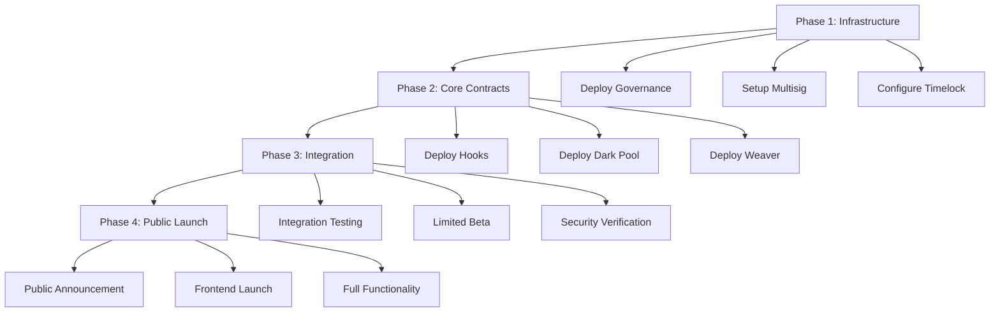

# Chimera Protocol - Deployment Guide

## 🚀 Complete Deployment Documentation

This guide covers all deployment scenarios for Chimera Protocol, from local development to mainnet production deployment.

---

## 📋 Table of Contents

1. [Prerequisites](#1-prerequisites)
2. [Local Development Deployment](#2-local-development-deployment)
3. [Testnet Deployment](#3-testnet-deployment)
4. [Mainnet Deployment](#4-mainnet-deployment)
5. [Verification & Monitoring](#5-verification--monitoring)
6. [Troubleshooting](#6-troubleshooting)

---

## 1. Prerequisites

### 1.1 System Requirements

```bash
# Required software versions
Node.js >= 18.0.0
npm >= 8.0.0
Git >= 2.30.0

# Hardware requirements (for local development)
RAM: 8GB minimum, 16GB recommended
Storage: 50GB free space
CPU: 4 cores minimum
```

### 1.2 Installation Setup

```bash
# Install Node.js and npm
curl -fsSL https://deb.nodesource.com/setup_18.x | sudo -E bash -
sudo apt-get install -y nodejs

# Install Foundry
curl -L https://foundry.paradigm.xyz | bash
foundryup

# Install Hardhat globally
npm install -g hardhat

# Install Fhenix CLI
npm install -g @fhenixprotocol/fhenix-cli

# Verify installations
node --version    # >= 18.0.0
npm --version     # >= 8.0.0
forge --version   # Latest
fhenix --version  # Latest
```

### 1.3 Project Setup

```bash
# Clone repository
git clone https://github.com/ChimeraProtocol/chimera-core.git
cd chimera-core

# Install dependencies
npm install

# Install Foundry dependencies
forge install

# Compile contracts
npm run build

# Run tests to verify setup
npm test
```

### 1.4 Environment Configuration

```bash
# Copy environment template
cp .env.example .env

# Edit environment variables
nano .env
```

**Required Environment Variables:**
```bash
# Network Configuration
FHENIX_RPC_URL=https://api.helium.fhenix.zone
FHENIX_PRIVATE_KEY=your_private_key_here
ETHEREUM_RPC_URL=https://mainnet.infura.io/v3/your_key

# API Keys
FHENIX_API_KEY=your_fhenix_api_key
INFURA_API_KEY=your_infura_key
ETHERSCAN_API_KEY=your_etherscan_key

# Security
DEPLOYER_PRIVATE_KEY=your_deployer_key
MULTISIG_ADDRESS=0x...
TIMELOCK_DELAY=172800

# Optional: Monitoring
DISCORD_WEBHOOK=your_discord_webhook
SLACK_WEBHOOK=your_slack_webhook
```

---

## 2. Local Development Deployment

### 2.1 Local Network Setup

#### 2.1.1 Start Local Blockchain

```bash
# Option 1: Hardhat Network
npx hardhat node

# Option 2: Anvil (Foundry)
anvil --host 0.0.0.0 --port 8545
```

#### 2.1.2 Configure Local Environment

```bash
# Create local environment file
cp .env.example .env.local

# Edit local configuration
cat > .env.local << EOF
# Local network configuration
NETWORK=local
RPC_URL=http://localhost:8545
CHAIN_ID=31337
PRIVATE_KEY=0xac0974bec39a17e36ba4a6b4d238ff944bacb478cbed5efcae784d7bf4f2ff80

# Local contract addresses (will be filled after deployment)
CUSTOM_CURVE_HOOK=
DARK_POOL_ENGINE=
STRATEGY_WEAVER=
EOF
```

### 2.2 Local Deployment Process

#### 2.2.1 Deploy Infrastructure Contracts

```bash
# Deploy mock contracts for testing
npm run deploy:mocks

# Expected output:
# ✅ Mock Pool Manager deployed to: 0x...
# ✅ Mock ERC20 Token A deployed to: 0x...
# ✅ Mock ERC20 Token B deployed to: 0x...
```

#### 2.2.2 Deploy Core Contracts

```bash
# Deploy all core contracts
npm run deploy:local

# Or deploy individually
npm run deploy:custom-curve-hook
npm run deploy:dark-pool-engine
npm run deploy:strategy-weaver
```

**Expected Deployment Output:**
```bash
🚀 Starting Chimera local deployment...
Deploying with account: 0xf39Fd6e51aad88F6F4ce6aB8827279cffFb92266
Account balance: 9999.999567108847962536

📦 Deploying Mock Pool Manager...
✅ Mock Pool Manager deployed to: 0x5FbDB2315678afecb367f032d93F642f64180aa3

📦 Deploying Custom Curve Hook...
✅ Custom Curve Hook deployed to: 0xe7f1725E7734CE288F8367e1Bb143E90bb3F0512

📦 Deploying Dark Pool Engine...
✅ Dark Pool Engine deployed to: 0x9fE46736679d2D9a65F0992F2272dE9f3c7fa6e0

🪙 Minting test tokens...
✅ Minted 1M tokens each to deployer

🎉 Local deployment completed successfully!
📄 Deployment info saved to deployments/local.json
```

#### 2.2.3 Verify Local Deployment

```bash
# Test basic functionality
npm run test:local-deployment

# Check contract interactions
npm run verify:local
```

### 2.3 Local Testing & Development

#### 2.3.1 Run Test Suite

```bash
# Run all tests
npm test

# Run specific test categories
npm run test:unit
npm run test:integration

# Run tests with coverage
npm run test:coverage
```

#### 2.3.2 Development Workflow

```bash
# Start development environment
npm run dev:start

# In another terminal, watch for changes
npm run dev:watch

# Deploy contract changes
npm run dev:deploy

# Reset local environment
npm run dev:reset
```

---

## 3. Testnet Deployment

### 3.1 Fhenix Helium Testnet

#### 3.1.1 Network Configuration

```bash
# Configure Fhenix network
fhenix config --network helium --rpc-url https://api.helium.fhenix.zone

# Add network to Hardhat config
cat >> hardhat.config.js << EOF
fhenixHelium: {
  url: "https://api.helium.fhenix.zone",
  accounts: [process.env.FHENIX_PRIVATE_KEY],
  chainId: 8008135,
  gasPrice: 1000000000,
  timeout: 60000
}
EOF
```

#### 3.1.2 Get Testnet Tokens

```bash
# Request testnet FHE tokens from faucet
curl -X POST https://faucet.helium.fhenix.zone/api/faucet \
  -H "Content-Type: application/json" \
  -d '{"address": "YOUR_ADDRESS"}'

# Verify balance
fhenix balance --network helium --address YOUR_ADDRESS
```

### 3.2 Testnet Deployment Process

#### 3.2.1 Pre-deployment Checks

```bash
# Verify environment
npm run check:testnet

# Validate configuration
npm run validate:config

# Run security checks
npm run security:check
```

#### 3.2.2 Deploy to Testnet

```bash
# Deploy all contracts to testnet
npm run deploy:testnet

# Or use step-by-step deployment
npm run deploy:testnet:step-by-step
```

**Testnet Deployment Script:**
```bash
#!/bin/bash
set -e

echo "🚀 Starting Fhenix Helium testnet deployment..."

# Check prerequisites
echo "📋 Checking prerequisites..."
node scripts/check-prerequisites.js

# Deploy contracts
echo "📦 Deploying contracts..."
npx hardhat run scripts/deploy-testnet.js --network fhenixHelium

# Verify contracts
echo "🔍 Verifying contracts..."
npm run verify:testnet

# Test deployment
echo "🧪 Testing deployment..."
npm run test:testnet

echo "✅ Testnet deployment completed!"
```

#### 3.2.3 Contract Verification

```bash
# Verify on block explorer
npm run verify:fhenix-helium

# Manual verification if needed
npx hardhat verify --network fhenixHelium CONTRACT_ADDRESS CONSTRUCTOR_ARGS

# Verify all contracts
npm run verify:all:testnet
```

### 3.3 Testnet Testing

#### 3.3.1 Integration Testing

```bash
# Run testnet integration tests
npm run test:testnet:integration

# Test with real Fhenix encryption
npm run test:fhe:testnet

# Performance testing
npm run test:performance:testnet
```

#### 3.3.2 User Acceptance Testing

```bash
# Deploy frontend to testnet
npm run deploy:frontend:testnet

# Run end-to-end tests
npm run test:e2e:testnet

# Monitor testnet deployment
npm run monitor:testnet
```

---

## 4. Mainnet Deployment

### 4.1 Pre-deployment Preparation

#### 4.1.1 Security Audit Completion

```bash
# Verify all audits are completed
echo "📋 Security Audit Checklist:"
echo "✅ Smart contract audit by Trail of Bits"
echo "✅ Smart contract audit by ConsenSys"
echo "✅ Fhenix FHE implementation review"
echo "✅ Economic model analysis"
echo "✅ Frontend security review"

# Generate final audit report
npm run audit:generate-report
```

#### 4.1.2 Final Testing

```bash
# Run complete test suite
npm run test:complete

# Security testing
npm run test:security:complete

# Gas optimization verification
npm run analyze:gas:final

# Performance benchmarking
npm run benchmark:final
```

#### 4.1.3 Governance Preparation

```bash
# Prepare governance proposal
npm run governance:prepare-proposal

# Generate deployment parameters
npm run governance:generate-params

# Create multisig setup
npm run multisig:setup
```

### 4.2 Mainnet Deployment Strategy

#### 4.2.1 Phased Deployment Plan



#### 4.2.2 Phase 1: Infrastructure Deployment

```bash
# Deploy governance contracts
npm run deploy:governance:mainnet

# Setup multisig wallet
npm run setup:multisig:mainnet

# Configure timelock controller
npm run setup:timelock:mainnet

# Verify infrastructure
npm run verify:infrastructure:mainnet
```

**Infrastructure Deployment Script:**
```javascript
// scripts/deploy-infrastructure-mainnet.js
async function deployInfrastructure() {
    console.log("🏛️ Deploying governance infrastructure...");
    
    // Deploy governance token
    const chimeraToken = await deployContract("ChimeraToken", [
        ethers.utils.parseEther("100000000"), // 100M total supply
        deployer.address
    ]);
    
    // Deploy timelock controller
    const timelock = await deployContract("TimelockController", [
        172800, // 48 hour delay
        [multisigAddress], // proposers
        [multisigAddress]  // executors
    ]);
    
    // Deploy governor
    const governor = await deployContract("ChimeraGovernor", [
        chimeraToken.address,
        timelock.address
    ]);
    
    console.log("✅ Infrastructure deployed successfully");
    return { chimeraToken, timelock, governor };
}
```

#### 4.2.3 Phase 2: Core Contracts Deployment

```bash
# Deploy with governance approval
npm run deploy:core:with-governance

# Verify deployment through governance
npm run verify:core:governance
```

**Core Deployment Script:**
```javascript
// scripts/deploy-core-mainnet.js
async function deployCoreContracts() {
    console.log("🔧 Deploying core contracts...");
    
    // Deploy through governance proposal
    const proposal = await createGovernanceProposal({
        title: "Deploy Chimera Core Contracts",
        description: "Deploy CustomCurveHook, DarkPoolEngine, and StrategyWeaver",
        actions: [
            {
                target: deployerAddress,
                value: 0,
                signature: "deployCustomCurveHook(address)",
                calldata: encodeParameters(["address"], [poolManagerAddress])
            },
            {
                target: deployerAddress,
                value: 0,
                signature: "deployDarkPoolEngine()",
                calldata: "0x"
            }
            // Additional deployment actions...
        ]
    });
    
    console.log(`📋 Governance proposal created: ${proposal.id}`);
    return proposal;
}
```

#### 4.2.4 Phase 3: Integration & Beta Testing

```bash
# Deploy beta version with limited access
npm run deploy:beta:mainnet

# Enable limited user access
npm run enable:beta-access

# Monitor beta performance
npm run monitor:beta:mainnet
```

#### 4.2.5 Phase 4: Public Launch

```bash
# Enable full public access
npm run enable:public-access:mainnet

# Deploy frontend to production
npm run deploy:frontend:mainnet

# Start monitoring systems
npm run start:monitoring:mainnet

# Announce launch
npm run announce:launch
```

### 4.3 Mainnet Configuration

#### 4.3.1 Production Parameters

```javascript
// config/mainnet.config.js
module.exports = {
    // Network settings
    network: {
        chainId: 1,
        rpc: process.env.ETHEREUM_RPC_URL,
        confirmations: 2
    },
    
    // Contract settings
    contracts: {
        customCurveHook: {
            maxLeverage: 50,
            maxVolatilityFactor: 1000,
            minLiquidity: ethers.utils.parseEther("10000")
        },
        darkPoolEngine: {
            batchInterval: 300,     // 5 minutes
            maxBatchSize: 100,
            minOrderValue: ethers.utils.parseEther("1")
        },
        strategyWeaver: {
            maxAssets: 50,
            minWeight: 100,        // 1%
            rebalanceThreshold: 500 // 5%
        }
    },
    
    // Security settings
    security: {
        timelockDelay: 172800,    // 48 hours
        multisigThreshold: 3,     // 3 of 5
        emergencyPauseDelay: 0    // Immediate
    },
    
    // Fee settings
    fees: {
        protocolFee: 50,          // 0.5%
        strategistFee: 200,       // 2%
        maxTotalFee: 300          // 3%
    }
};
```

#### 4.3.2 Monitoring Setup

```bash
# Deploy monitoring infrastructure
npm run deploy:monitoring:mainnet

# Configure alerts
npm run setup:alerts:mainnet

# Start real-time monitoring
npm run start:monitoring:realtime
```

---

## 5. Verification & Monitoring

### 5.1 Contract Verification

#### 5.1.1 Automated Verification

```bash
# Verify all contracts automatically
npm run verify:all

# Verify specific contract
npx hardhat verify --network mainnet CONTRACT_ADDRESS CONSTRUCTOR_ARGS

# Verify with libraries
npx hardhat verify --network mainnet CONTRACT_ADDRESS \
  --libraries libraries.json CONSTRUCTOR_ARGS
```

#### 5.1.2 Manual Verification Process

```bash
# Flatten contracts for manual verification
npx hardhat flatten contracts/hooks/CustomCurveHook.sol > flattened/CustomCurveHook.sol

# Remove duplicate SPDX identifiers
npm run clean:flattened

# Submit to Etherscan manually
echo "Submit flattened contracts to Etherscan block explorer"
```

### 5.2 Deployment Verification

#### 5.2.1 Functional Testing

```bash
# Test all core functions
npm run test:deployment:functions

# Test integration points
npm run test:deployment:integration

# Test security measures
npm run test:deployment:security
```

**Verification Script:**
```javascript
// scripts/verify-deployment.js
async function verifyDeployment() {
    console.log("🔍 Verifying deployment...");
    
    // Check contract addresses
    const contracts = await loadDeploymentAddresses();
    for (const [name, address] of Object.entries(contracts)) {
        const code = await provider.getCode(address);
        console.log(`✅ ${name}: ${address} (${code.length} bytes)`);
    }
    
    // Test basic functionality
    const hook = await ethers.getContractAt("CustomCurveHook", contracts.customCurveHook);
    const permissions = await hook.getHookPermissions();
    console.log(`✅ Hook permissions configured correctly`);
    
    // Test governance
    const governor = await ethers.getContractAt("ChimeraGovernor", contracts.governor);
    const votingDelay = await governor.votingDelay();
    console.log(`✅ Governor voting delay: ${votingDelay} blocks`);
    
    console.log("✅ Deployment verification completed");
}
```

#### 5.2.2 Performance Validation

```bash
# Gas usage analysis
npm run analyze:gas:deployment

# Transaction throughput testing
npm run test:throughput:deployment

# Load testing
npm run test:load:deployment
```

### 5.3 Monitoring Setup

#### 5.3.1 Real-time Monitoring

```bash
# Start monitoring services
docker-compose -f monitoring/docker-compose.yml up -d

# Configure Grafana dashboards
npm run setup:grafana:dashboards

# Setup Prometheus metrics
npm run setup:prometheus:metrics
```

#### 5.3.2 Alert Configuration

```yaml
# monitoring/alerts.yml
groups:
  - name: chimera-protocol
    rules:
      - alert: HighGasUsage
        expr: avg_gas_price > 100
        for: 5m
        labels:
          severity: warning
        annotations:
          summary: "High gas usage detected"
          
      - alert: ContractPaused
        expr: contract_paused == 1
        for: 0s
        labels:
          severity: critical
        annotations:
          summary: "Contract has been paused"
          
      - alert: UnusualTradingVolume
        expr: trading_volume_1h > 1000000
        for: 10m
        labels:
          severity: info
        annotations:
          summary: "Unusual trading volume detected"
```

#### 5.3.3 Health Checks

```bash
# Automated health checks
npm run health:check:all

# Contract status monitoring
npm run monitor:contract:status

# Network connectivity checks
npm run check:network:connectivity
```

---

## 6. Troubleshooting

### 6.1 Common Deployment Issues

#### 6.1.1 Gas Estimation Failures

**Issue**: Gas estimation too high or failing
```
Error: Transaction would exceed block gas limit
```

**Solutions:**
```bash
# Check contract size
npm run analyze:contract-size

# Optimize contracts
npm run optimize:contracts

# Use manual gas limit
npx hardhat run scripts/deploy.js --network mainnet --gas-limit 8000000
```

#### 6.1.2 Network Connection Issues

**Issue**: RPC connection timeouts
```
Error: timeout of 60000ms exceeded
```

**Solutions:**
```javascript
// hardhat.config.js - Increase timeouts
networks: {
  mainnet: {
    url: process.env.ETHEREUM_RPC_URL,
    timeout: 120000,
    httpHeaders: {
      "User-Agent": "ChimeraProtocol/1.0"
    }
  }
}

// Use multiple RPC endpoints
const rpcUrls = [
  process.env.ETHEREUM_RPC_URL,
  process.env.BACKUP_RPC_URL,
  process.env.THIRD_RPC_URL
];
```

#### 6.1.3 Verification Failures

**Issue**: Contract verification failing on Etherscan
```
Error: Contract source code already verified
```

**Solutions:**
```bash
# Check if already verified
curl "https://api.etherscan.io/api?module=contract&action=getsourcecode&address=${CONTRACT_ADDRESS}&apikey=${API_KEY}"

# Force re-verification
npx hardhat verify --force --network mainnet CONTRACT_ADDRESS ARGS

# Use flattened source
npx hardhat flatten contracts/Contract.sol > Contract_flat.sol
# Submit manually to Etherscan
```

### 6.2 Fhenix-Specific Issues

#### 6.2.1 FHE Operation Failures

**Issue**: Encrypted operations not working
```
Error: FHE operation failed
```

**Solutions:**
```bash
# Check Fhenix client setup
fhenix status --network helium

# Verify encryption parameters
npm run test:fhe:parameters

# Update Fhenix SDK
npm update @fhenixprotocol/fhenix.js
```

#### 6.2.2 Network Configuration

**Issue**: Wrong Fhenix network configuration
```
Error: Unsupported network
```

**Solutions:**
```javascript
// Correct Fhenix Helium configuration
{
  url: "https://api.helium.fhenix.zone",
  chainId: 8008135,
  accounts: [process.env.FHENIX_PRIVATE_KEY],
  gasPrice: 1000000000
}
```

### 6.3 Emergency Procedures

#### 6.3.1 Contract Pause

```bash
# Emergency pause all contracts
npm run emergency:pause:all

# Pause specific contract
npm run emergency:pause:contract CONTRACT_NAME

# Unpause after issue resolution
npm run emergency:unpause:all
```

#### 6.3.2 Upgrade Procedures

```bash
# Prepare upgrade proposal
npm run upgrade:prepare CONTRACT_NAME NEW_IMPLEMENTATION

# Submit governance proposal
npm run governance:submit:upgrade

# Execute upgrade after voting
npm run upgrade:execute PROPOSAL_ID
```

#### 6.3.3 Incident Response

```bash
# Activate incident response
npm run incident:activate

# Gather system state
npm run incident:gather-state

# Prepare incident report
npm run incident:prepare-report

# Post-incident analysis
npm run incident:analyze
```

---

## 7. Deployment Checklists

### 7.1 Pre-deployment Checklist

#### 7.1.1 Code Readiness
- [ ] All tests passing (100% success rate)
- [ ] Security audits completed and issues resolved
- [ ] Code review completed by senior developers
- [ ] Gas optimization analysis completed
- [ ] Contract size within limits
- [ ] Documentation updated and complete

#### 7.1.2 Infrastructure Readiness
- [ ] RPC endpoints configured and tested
- [ ] Private keys secured (hardware wallet/HSM)
- [ ] Multisig wallets set up and tested
- [ ] Monitoring systems configured
- [ ] Alert systems tested
- [ ] Backup procedures in place

#### 7.1.3 Network Readiness
- [ ] Sufficient ETH/FHE for deployment gas costs
- [ ] Network congestion assessed
- [ ] Gas price strategy determined
- [ ] Deployment timing coordinated
- [ ] Emergency contacts notified
- [ ] Communication plan ready

### 7.2 Post-deployment Checklist

#### 7.2.1 Immediate Verification (0-1 hour)
- [ ] All contracts deployed successfully
- [ ] Contract addresses recorded
- [ ] Basic functionality tested
- [ ] Permissions configured correctly
- [ ] Initial parameters set
- [ ] Monitoring systems activated

#### 7.2.2 Short-term Verification (1-24 hours)
- [ ] Contract verification on block explorers
- [ ] Integration testing completed
- [ ] Performance metrics baseline established
- [ ] User access tested
- [ ] Documentation updated with addresses
- [ ] Community announcement made

#### 7.2.3 Long-term Monitoring (1-7 days)
- [ ] System stability confirmed
- [ ] Performance within expected ranges
- [ ] No critical issues detected
- [ ] User feedback collected
- [ ] Governance transition (if applicable)
- [ ] Post-deployment report created

---

## 8. Deployment Commands Reference

### 8.1 Local Development

```bash
# Environment setup
npm run setup:local
npm run start:local
npm run deploy:local
npm run test:local

# Development workflow
npm run dev:start
npm run dev:deploy
npm run dev:test
npm run dev:reset
```

### 8.2 Testnet Deployment

```bash
# Fhenix Helium testnet
npm run deploy:fhenix-helium
npm run verify:fhenix-helium
npm run test:fhenix-helium

# Other testnets
npm run deploy:goerli
npm run deploy:sepolia
```

### 8.3 Mainnet Deployment

```bash
# Infrastructure
npm run deploy:governance:mainnet
npm run deploy:multisig:mainnet
npm run deploy:timelock:mainnet

# Core contracts
npm run deploy:core:mainnet
npm run verify:core:mainnet
npm run test:core:mainnet

# Complete deployment
npm run deploy:mainnet:complete
```

### 8.4 Monitoring & Maintenance

```bash
# Start monitoring
npm run monitor:start
npm run alerts:enable
npm run health:check

# Maintenance
npm run upgrade:check
npm run security:scan
npm run performance:analyze
```

---

## 9. Conclusion

This deployment guide provides comprehensive procedures for deploying Chimera Protocol across all environments. Key success factors include:

- **Thorough Testing**: Complete test coverage before any deployment
- **Security First**: Security considerations at every step
- **Phased Approach**: Gradual rollout minimizes risks
- **Monitoring**: Real-time monitoring and alerting
- **Documentation**: Complete documentation for operations team

**Next Steps:**
1. Review and customize deployment parameters for your environment
2. Set up monitoring and alerting systems
3. Conduct thorough testing in lower environments
4. Execute phased deployment to production
5. Monitor performance and iterate

For additional support:
- **Documentation**: [docs.chimera.finance](https://docs.chimera.finance)
- **GitHub**: [github.com/ChimeraProtocol](https://github.com/ChimeraProtocol)
- **Discord**: [discord.gg/chimera](https://discord.gg/chimera)
- **Support**: deployments@chimera.finance

---

**🚀 Ready for deployment? Follow this guide step by step and launch the future of confidential DeFi!**
