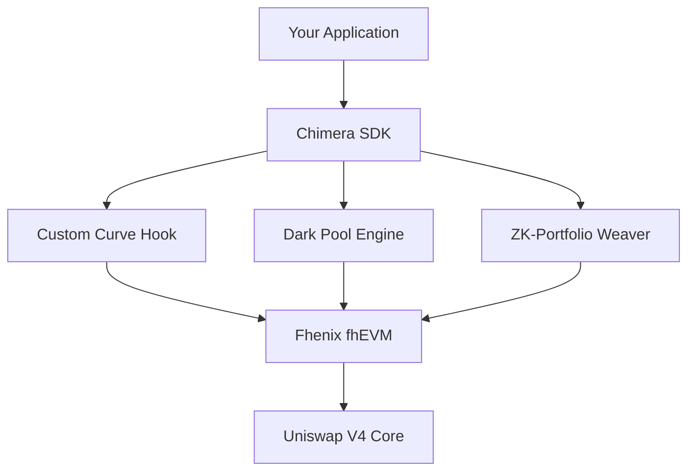

# Chimera Protocol - Developer Guide

## 🚀 Complete Developer Documentation & API Reference

Welcome to Chimera Protocol! This guide provides everything you need to build on the world's first confidential AMM.

---

## 📋 Table of Contents

1. [Quick Start](#1-quick-start)
2. [Core Concepts](#2-core-concepts)
3. [Smart Contract API](#3-smart-contract-api)
4. [SDK Documentation](#4-sdk-documentation)
5. [Frontend Integration](#5-frontend-integration)
6. [Examples & Tutorials](#6-examples--tutorials)
7. [Best Practices](#7-best-practices)
8. [Troubleshooting](#8-troubleshooting)

---

## 1. Quick Start

### 1.1 Environment Setup

```bash
# Install dependencies
npm install @chimera-protocol/core @chimera-protocol/sdk

# Or with yarn
yarn add @chimera-protocol/core @chimera-protocol/sdk
```

### 1.2 Basic Integration

```typescript
import { ChimeraClient, CurveType } from '@chimera-protocol/sdk';

// Initialize client
const chimera = new ChimeraClient({
  provider: window.ethereum,
  network: 'fhenixHelium'
});

// Create a simple linear strategy
const strategy = await chimera.strategies.create({
  curveType: CurveType.Linear,
  parameters: [1000, 500], // slope, intercept
  maxLeverage: 10,
  volatilityFactor: 100
});

console.log(`Strategy created: ${strategy.poolId}`);
```

### 1.3 Hello World Example

```typescript
// Complete example: Create and test a strategy
async function helloChimera() {
  const chimera = new ChimeraClient({ 
    provider: window.ethereum,
    network: 'fhenixHelium'
  });
  
  // Connect wallet
  await chimera.connect();
  
  // Create linear pricing strategy
  const strategy = await chimera.strategies.create({
    curveType: CurveType.Linear,
    parameters: [2000, 1000], // Higher slope for dynamic pricing
    maxLeverage: 5,
    tokenA: '0x...', // Token addresses
    tokenB: '0x...'
  });
  
  // Submit a dark pool order
  const order = await chimera.darkPool.submitOrder({
    amountIn: ethers.utils.parseEther('100'),
    minAmountOut: ethers.utils.parseEther('95'),
    tokenIn: strategy.tokenA,
    tokenOut: strategy.tokenB,
    deadline: Math.floor(Date.now() / 1000) + 3600 // 1 hour
  });
  
  console.log('🎉 Successfully created strategy and submitted order!');
  return { strategy, order };
}
```

---

## 2. Core Concepts

### 2.1 Architecture Overview



### 2.2 Key Components

#### 2.2.1 Custom Curve Hook
Enables programmable bonding curves with encrypted parameters:
- **6 Curve Types**: Linear, Exponential, Sigmoid, Logarithmic, Polynomial, Custom
- **Encrypted Parameters**: Strategy secrets protected by FHE
- **Dynamic Pricing**: Real-time volatility and leverage adjustments

#### 2.2.2 Dark Pool Engine
MEV-resistant trading through confidential order processing:
- **Encrypted Orders**: Trade intents hidden until execution
- **Batch Processing**: Uniform price discovery eliminates MEV
- **Automatic Execution**: Orders filled at fair prices

#### 2.2.3 ZK-Portfolio Weaver
Confidential portfolio composition and management:
- **Hidden Allocations**: Asset weights encrypted
- **Automated Rebalancing**: Maintain target allocations privately
- **Performance Tracking**: Private analytics and reporting

### 2.3 Encryption Model

#### 2.3.1 Fhenix Integration

```typescript
// Client-side encryption
const fhenixClient = new FhenixClient({ provider });

// Encrypt sensitive parameters
const encryptedStrike = await fhenixClient.encrypt_uint64(strikePrice);
const encryptedLeverage = await fhenixClient.encrypt_uint64(leverage);

// Submit to contract
await contract.setStrategy(poolId, encryptedStrike, encryptedLeverage);
```

#### 2.3.2 Supported Data Types

| Type | Description | Use Case |
|------|-------------|----------|
| `FheUint64` | 64-bit encrypted integers | Prices, amounts, coefficients |
| `FheBytes32` | 32-byte encrypted data | Formula hashes, metadata |
| `FheBool` | Encrypted boolean | Conditional logic, flags |

---

## 3. Smart Contract API

### 3.1 Custom Curve Hook

#### 3.1.1 Interface Definition

```solidity
interface ICustomCurve {
    enum CurveType { Linear, Exponential, Sigmoid, Logarithmic, Polynomial, Custom }
    
    struct CurveParams {
        CurveType curveType;
        FheUint64[] encryptedCoefficients;
        FheBytes32 formulaHash;
        uint256 maxLeverage;
        uint256 volatilityFactor;
    }
    
    function setCurveParameters(
        PoolId poolId,
        CurveType curveType,
        bytes[] calldata encryptedCoefficients,
        bytes32 formulaHash,
        uint256 maxLeverage,
        uint256 volatilityFactor
    ) external;
    
    function calculatePrice(
        PoolId poolId,
        uint256 reserves0,
        uint256 reserves1,
        bool zeroForOne
    ) external view returns (FheUint64);
}
```

#### 3.1.2 Usage Examples

**Linear Curve Setup:**
```solidity
// Deploy hook
CustomCurveHook hook = new CustomCurveHook(poolManager);

// Set linear curve: P(x) = 1000x + 500
bytes[] memory coefficients = new bytes[](2);
coefficients[0] = fhenixClient.encrypt_uint64(1000); // slope
coefficients[1] = fhenixClient.encrypt_uint64(500);  // intercept

hook.setCurveParameters(
    poolId,
    ICustomCurve.CurveType.Linear,
    coefficients,
    keccak256("linear-v1"),
    10, // 10x max leverage
    100 // 1% volatility factor
);
```

**Exponential Curve Setup:**
```solidity
// Exponential curve: P(x) = 100 * e^(0.001x) + 50
bytes[] memory coefficients = new bytes[](3);
coefficients[0] = fhenixClient.encrypt_uint64(100);  // base
coefficients[1] = fhenixClient.encrypt_uint64(1);    // exponent multiplier (scaled)
coefficients[2] = fhenixClient.encrypt_uint64(50);   // offset

hook.setCurveParameters(
    poolId,
    ICustomCurve.CurveType.Exponential,
    coefficients,
    keccak256("exp-growth-v1"),
    5,   // 5x max leverage
    200  // 2% volatility factor
);
```

#### 3.1.3 Events

```solidity
event CurveParametersSet(
    PoolId indexed poolId, 
    CurveType curveType
);

event CurveComputed(
    PoolId indexed poolId, 
    uint256 timestamp
);

event PriceCalculated(
    PoolId indexed poolId, 
    uint256 newPrice
);
```

### 3.2 Dark Pool Engine

#### 3.2.1 Interface Definition

```solidity
interface IDarkPoolEngine {
    struct ConfidentialOrder {
        FheUint64 amountIn;
        FheUint64 minAmountOut;
        FheUint64 maxSlippage;
        FheBytes32 orderType;
        address trader;
        address tokenIn;
        address tokenOut;
        uint256 deadline;
        bool isActive;
    }
    
    function submitConfidentialOrder(
        bytes calldata encAmountIn,
        bytes calldata encMinAmountOut,
        bytes calldata encMaxSlippage,
        bytes calldata encOrderType,
        address tokenIn,
        address tokenOut,
        uint256 deadline
    ) external returns (uint256 orderId);
    
    function cancelOrder(uint256 orderId) external;
    function executeBatch() external;
}
```

#### 3.2.2 Usage Examples

**Submit Dark Pool Order:**
```solidity
// Encrypt order parameters
bytes memory encAmountIn = fhenixClient.encrypt_uint64(1000e18);
bytes memory encMinAmountOut = fhenixClient.encrypt_uint64(950e18);
bytes memory encMaxSlippage = fhenixClient.encrypt_uint64(50); // 0.5%
bytes memory encOrderType = fhenixClient.encrypt_bytes32("MARKET");

// Submit order
uint256 orderId = darkPool.submitConfidentialOrder(
    encAmountIn,
    encMinAmountOut,
    encMaxSlippage,
    encOrderType,
    address(tokenA),
    address(tokenB),
    block.timestamp + 3600 // 1 hour deadline
);
```

**Batch Execution:**
```solidity
// Check if batch should be executed
if (darkPool.shouldExecuteBatch()) {
    darkPool.executeBatch();
}

// Get batch information
(uint256 totalOrders, uint256 executionTime, bool isExecuted) = 
    darkPool.getBatchInfo(batchId);
```

#### 3.2.3 Events

```solidity
event ConfidentialOrderSubmitted(
    uint256 indexed orderId, 
    address indexed trader
);

event BatchExecuted(
    uint256 indexed batchId, 
    uint256 orderCount, 
    uint256 timestamp
);

event OrderFilled(
    uint256 indexed orderId, 
    address indexed trader
);

event OrderCancelled(
    uint256 indexed orderId, 
    address indexed trader
);
```

---

## 4. SDK Documentation

### 4.1 Installation & Setup

```bash
npm install @chimera-protocol/sdk @fhenixprotocol/fhenix.js
```

```typescript
import { ChimeraClient } from '@chimera-protocol/sdk';

const chimera = new ChimeraClient({
  provider: window.ethereum, // or custom provider
  network: 'fhenixHelium',   // or 'local', 'mainnet'
  config: {
    rpcUrl: 'https://api.helium.fhenix.zone',
    contracts: {
      customCurveHook: '0x...',
      darkPoolEngine: '0x...',
      strategyWeaver: '0x...'
    }
  }
});
```

### 4.2 ChimeraClient API

#### 4.2.1 Core Methods

```typescript
class ChimeraClient {
  // Connection management
  async connect(): Promise<void>;
  async disconnect(): Promise<void>;
  get isConnected(): boolean;
  get address(): string | null;
  
  // Network information
  get network(): Network;
  get chainId(): number;
  
  // Strategy management
  strategies: StrategyManager;
  
  // Dark pool operations
  darkPool: DarkPoolManager;
  
  // Portfolio management
  portfolios: PortfolioManager;
}
```

#### 4.2.2 Strategy Manager

```typescript
class StrategyManager {
  // Create new strategy
  async create(params: StrategyParams): Promise<Strategy>;
  
  // Get existing strategy
  async get(poolId: string): Promise<Strategy>;
  
  // List user strategies
  async list(user?: string): Promise<Strategy[]>;
  
  // Update strategy parameters
  async update(poolId: string, params: Partial<StrategyParams>): Promise<void>;
  
  // Calculate strategy performance
  async getPerformance(poolId: string): Promise<PerformanceMetrics>;
}

interface StrategyParams {
  curveType: CurveType;
  parameters: number[];
  maxLeverage: number;
  volatilityFactor?: number;
  tokenA: string;
  tokenB: string;
  fee?: number;
}

interface Strategy {
  poolId: string;
  creator: string;
  curveType: CurveType;
  maxLeverage: number;
  tokenA: string;
  tokenB: string;
  createdAt: Date;
  isActive: boolean;
}
```

#### 4.2.3 Dark Pool Manager

```typescript
class DarkPoolManager {
  // Submit confidential order
  async submitOrder(params: OrderParams): Promise<Order>;
  
  // Cancel order
  async cancelOrder(orderId: string): Promise<void>;
  
  // Get order status
  async getOrder(orderId: string): Promise<Order>;
  
  // List user orders
  async listOrders(user?: string): Promise<Order[]>;
  
  // Get batch information
  async getBatch(batchId: string): Promise<Batch>;
}

interface OrderParams {
  amountIn: BigNumber;
  minAmountOut: BigNumber;
  maxSlippage?: number;
  orderType?: OrderType;
  tokenIn: string;
  tokenOut: string;
  deadline: number;
}

interface Order {
  orderId: string;
  trader: string;
  tokenIn: string;
  tokenOut: string;
  deadline: number;
  isActive: boolean;
  submitTime: Date;
}
```

#### 4.2.4 Portfolio Manager

```typescript
class PortfolioManager {
  // Create new portfolio
  async create(params: PortfolioParams): Promise<Portfolio>;
  
  // Get portfolio
  async get(tokenId: string): Promise<Portfolio>;
  
  // Rebalance portfolio
  async rebalance(tokenId: string): Promise<void>;
  
  // Get portfolio performance
  async getPerformance(tokenId: string): Promise<PortfolioPerformance>;
}

interface PortfolioParams {
  assets: string[];
  weights: number[]; // Will be encrypted
  rebalanceThreshold?: number;
  managementFee?: number;
}

interface Portfolio {
  tokenId: string;
  manager: string;
  assets: string[];
  totalValue: BigNumber;
  createdAt: Date;
  lastRebalance: Date;
}
```

### 4.3 Utility Functions

#### 4.3.1 Encryption Helpers

```typescript
import { EncryptionUtils } from '@chimera-protocol/sdk';

// Encrypt parameters for strategy
const encryptedParams = await EncryptionUtils.encryptParameters({
  provider: window.ethereum,
  values: [1000, 500, 100], // slope, intercept, volatility
  types: ['uint64', 'uint64', 'uint64']
});

// Encrypt order details
const encryptedOrder = await EncryptionUtils.encryptOrder({
  provider: window.ethereum,
  amountIn: ethers.utils.parseEther('100'),
  minAmountOut: ethers.utils.parseEther('95'),
  maxSlippage: 50 // 0.5%
});
```

#### 4.3.2 Price Calculation

```typescript
import { PriceCalculator } from '@chimera-protocol/sdk';

// Calculate expected price for curve
const expectedPrice = PriceCalculator.calculateCurvePrice({
  curveType: CurveType.Linear,
  parameters: [1000, 500],
  reserves0: ethers.utils.parseEther('1000'),
  reserves1: ethers.utils.parseEther('2000'),
  zeroForOne: true
});

// Estimate gas for operations
const gasEstimate = await PriceCalculator.estimateGas({
  operation: 'createStrategy',
  curveType: CurveType.Exponential,
  provider: window.ethereum
});
```

---

## 5. Frontend Integration

### 5.1 React Integration

#### 5.1.1 Chimera Provider Setup

```typescript
// providers/ChimeraProvider.tsx
import { ChimeraClient } from '@chimera-protocol/sdk';
import { createContext, useContext, useEffect, useState } from 'react';

const ChimeraContext = createContext<ChimeraClient | null>(null);

export function ChimeraProvider({ children }: { children: React.ReactNode }) {
  const [chimera, setChimera] = useState<ChimeraClient | null>(null);
  
  useEffect(() => {
    const client = new ChimeraClient({
      provider: window.ethereum,
      network: 'fhenixHelium'
    });
    
    setChimera(client);
  }, []);
  
  return (
    <ChimeraContext.Provider value={chimera}>
      {children}
    </ChimeraContext.Provider>
  );
}

export const useChimera = () => {
  const context = useContext(ChimeraContext);
  if (!context) {
    throw new Error('useChimera must be used within ChimeraProvider');
  }
  return context;
};
```

#### 5.1.2 Custom Hooks

```typescript
// hooks/useStrategies.ts
import { useState, useEffect } from 'react';
import { useChimera } from '../providers/ChimeraProvider';

export function useStrategies() {
  const chimera = useChimera();
  const [strategies, setStrategies] = useState<Strategy[]>([]);
  const [loading, setLoading] = useState(true);
  
  useEffect(() => {
    async function loadStrategies() {
      try {
        const userStrategies = await chimera.strategies.list();
        setStrategies(userStrategies);
      } catch (error) {
        console.error('Failed to load strategies:', error);
      } finally {
        setLoading(false);
      }
    }
    
    loadStrategies();
  }, [chimera]);
  
  const createStrategy = async (params: StrategyParams) => {
    const newStrategy = await chimera.strategies.create(params);
    setStrategies(prev => [...prev, newStrategy]);
    return newStrategy;
  };
  
  return { strategies, loading, createStrategy };
}
```

#### 5.1.3 Strategy Creator Component

```typescript
// components/StrategyCreator.tsx
import { useState } from 'react';
import { useStrategies } from '../hooks/useStrategies';
import { CurveType, StrategyParams } from '@chimera-protocol/sdk';

export function StrategyCreator() {
  const { createStrategy } = useStrategies();
  const [formData, setFormData] = useState<Partial<StrategyParams>>({
    curveType: CurveType.Linear,
    maxLeverage: 10,
    volatilityFactor: 100
  });
  
  const handleSubmit = async (e: React.FormEvent) => {
    e.preventDefault();
    
    try {
      const strategy = await createStrategy(formData as StrategyParams);
      alert(`Strategy created! Pool ID: ${strategy.poolId}`);
    } catch (error) {
      alert(`Failed to create strategy: ${error.message}`);
    }
  };
  
  return (
    <form onSubmit={handleSubmit} className="strategy-creator">
      <h2>Create Strategy</h2>
      
      <div className="form-group">
        <label>Curve Type:</label>
        <select 
          value={formData.curveType} 
          onChange={(e) => setFormData({...formData, curveType: e.target.value as CurveType})}
        >
          <option value={CurveType.Linear}>Linear</option>
          <option value={CurveType.Exponential}>Exponential</option>
          <option value={CurveType.Sigmoid}>Sigmoid</option>
          <option value={CurveType.Logarithmic}>Logarithmic</option>
          <option value={CurveType.Polynomial}>Polynomial</option>
        </select>
      </div>
      
      <div className="form-group">
        <label>Parameters:</label>
        <input 
          type="text"
          placeholder="e.g., 1000,500 for linear slope,intercept"
          onChange={(e) => setFormData({
            ...formData, 
            parameters: e.target.value.split(',').map(Number)
          })}
        />
      </div>
      
      <div className="form-group">
        <label>Max Leverage:</label>
        <input 
          type="number"
          value={formData.maxLeverage}
          onChange={(e) => setFormData({...formData, maxLeverage: Number(e.target.value)})}
        />
      </div>
      
      <button type="submit">Create Strategy</button>
    </form>
  );
}
```

### 5.2 Dark Pool Interface

```typescript
// components/DarkPoolInterface.tsx
import { useState } from 'react';
import { useChimera } from '../providers/ChimeraProvider';
import { ethers } from 'ethers';

export function DarkPoolInterface() {
  const chimera = useChimera();
  const [orderData, setOrderData] = useState({
    amountIn: '',
    minAmountOut: '',
    tokenIn: '',
    tokenOut: '',
    deadline: 3600 // 1 hour
  });
  
  const submitOrder = async (e: React.FormEvent) => {
    e.preventDefault();
    
    try {
      const order = await chimera.darkPool.submitOrder({
        amountIn: ethers.utils.parseEther(orderData.amountIn),
        minAmountOut: ethers.utils.parseEther(orderData.minAmountOut),
        tokenIn: orderData.tokenIn,
        tokenOut: orderData.tokenOut,
        deadline: Math.floor(Date.now() / 1000) + orderData.deadline
      });
      
      alert(`Order submitted! Order ID: ${order.orderId}`);
    } catch (error) {
      alert(`Failed to submit order: ${error.message}`);
    }
  };
  
  return (
    <form onSubmit={submitOrder} className="dark-pool-interface">
      <h2>Submit Dark Pool Order</h2>
      
      <div className="form-group">
        <label>Amount In:</label>
        <input 
          type="number"
          step="0.01"
          value={orderData.amountIn}
          onChange={(e) => setOrderData({...orderData, amountIn: e.target.value})}
          placeholder="100.0"
        />
      </div>
      
      <div className="form-group">
        <label>Minimum Amount Out:</label>
        <input 
          type="number"
          step="0.01"
          value={orderData.minAmountOut}
          onChange={(e) => setOrderData({...orderData, minAmountOut: e.target.value})}
          placeholder="95.0"
        />
      </div>
      
      <div className="form-group">
        <label>Token In:</label>
        <input 
          type="text"
          value={orderData.tokenIn}
          onChange={(e) => setOrderData({...orderData, tokenIn: e.target.value})}
          placeholder="0x..."
        />
      </div>
      
      <div className="form-group">
        <label>Token Out:</label>
        <input 
          type="text"
          value={orderData.tokenOut}
          onChange={(e) => setOrderData({...orderData, tokenOut: e.target.value})}
          placeholder="0x..."
        />
      </div>
      
      <button type="submit">Submit Order</button>
    </form>
  );
}
```

---

## 6. Examples & Tutorials

### 6.1 Complete Example: DeFi Options Market

```typescript
// examples/options-market.ts
import { ChimeraClient, CurveType } from '@chimera-protocol/sdk';
import { ethers } from 'ethers';

async function createOptionsMarket() {
  // Initialize Chimera client
  const chimera = new ChimeraClient({
    provider: window.ethereum,
    network: 'fhenixHelium'
  });
  
  await chimera.connect();
  
  // Create sigmoid curve for options pricing
  // Sigmoid provides bounded price discovery ideal for options
  const optionsStrategy = await chimera.strategies.create({
    curveType: CurveType.Sigmoid,
    parameters: [
      100,  // L (maximum value)
      10,   // k (steepness)
      50,   // x0 (midpoint)
      10    // offset
    ],
    maxLeverage: 20, // Higher leverage for options
    volatilityFactor: 500, // 5% volatility adjustment
    tokenA: '0x...', // ETH address
    tokenB: '0x...', // USDC address
    fee: 3000 // 0.3% fee
  });
  
  console.log(`Options strategy created: ${optionsStrategy.poolId}`);
  
  // Create call option by submitting asymmetric liquidity
  const callOption = await chimera.darkPool.submitOrder({
    amountIn: ethers.utils.parseEther('10'), // 10 ETH premium
    minAmountOut: ethers.utils.parseUnits('15000', 6), // $15,000 USDC (strike)
    tokenIn: optionsStrategy.tokenA,
    tokenOut: optionsStrategy.tokenB,
    deadline: Math.floor(Date.now() / 1000) + 86400 * 30 // 30 days
  });
  
  console.log(`Call option created: ${callOption.orderId}`);
  
  return { optionsStrategy, callOption };
}
```

### 6.2 Tutorial: Building a Yield Strategy

```typescript
// tutorials/yield-strategy.ts
import { ChimeraClient, CurveType } from '@chimera-protocol/sdk';

/**
 * Tutorial: Create a yield optimization strategy
 * This strategy uses exponential curves to capture yield premiums
 */
async function buildYieldStrategy() {
  const chimera = new ChimeraClient({
    provider: window.ethereum,
    network: 'fhenixHelium'
  });
  
  // Step 1: Connect wallet
  await chimera.connect();
  console.log('✅ Wallet connected');
  
  // Step 2: Create exponential yield curve
  // Exponential curves capture compounding returns
  const yieldStrategy = await chimera.strategies.create({
    curveType: CurveType.Exponential,
    parameters: [
      1000, // Base multiplier
      5,    // Growth rate (0.005 scaled up)
      100   // Offset for base yield
    ],
    maxLeverage: 15,
    volatilityFactor: 150, // 1.5% volatility buffer
    tokenA: '0x...', // Yield token (e.g., stETH)
    tokenB: '0x...'  // Base token (e.g., ETH)
  });
  
  console.log('✅ Yield strategy deployed');
  
  // Step 3: Create a confidential portfolio with yield focus
  const yieldPortfolio = await chimera.portfolios.create({
    assets: [
      yieldStrategy.tokenA,
      yieldStrategy.tokenB,
      '0x...' // Additional yield token
    ],
    weights: [50, 30, 20], // 50%, 30%, 20% allocation
    rebalanceThreshold: 5, // Rebalance at 5% deviation
    managementFee: 100     // 1% annual fee
  });
  
  console.log('✅ Yield portfolio created');
  
  // Step 4: Monitor performance
  setInterval(async () => {
    const performance = await chimera.strategies.getPerformance(yieldStrategy.poolId);
    console.log(`Yield: ${performance.totalReturn}% | TVL: $${performance.tvl}`);
  }, 60000); // Check every minute
  
  return { yieldStrategy, yieldPortfolio };
}
```

### 6.3 Advanced Example: Multi-Strategy Portfolio

```typescript
// examples/multi-strategy-portfolio.ts
import { ChimeraClient, CurveType } from '@chimera-protocol/sdk';

async function createMultiStrategyPortfolio() {
  const chimera = new ChimeraClient({
    provider: window.ethereum,
    network: 'fhenixHelium'
  });
  
  await chimera.connect();
  
  // Create multiple strategies with different characteristics
  
  // 1. Conservative linear strategy
  const conservativeStrategy = await chimera.strategies.create({
    curveType: CurveType.Linear,
    parameters: [500, 1000], // Low slope, higher intercept
    maxLeverage: 5,
    volatilityFactor: 50,
    tokenA: '0x...', // Stable pair
    tokenB: '0x...'
  });
  
  // 2. Growth exponential strategy
  const growthStrategy = await chimera.strategies.create({
    curveType: CurveType.Exponential,
    parameters: [100, 10, 50],
    maxLeverage: 10,
    volatilityFactor: 200,
    tokenA: '0x...', // Volatile pair
    tokenB: '0x...'
  });
  
  // 3. Options sigmoid strategy
  const optionsStrategy = await chimera.strategies.create({
    curveType: CurveType.Sigmoid,
    parameters: [200, 15, 100, 20],
    maxLeverage: 25,
    volatilityFactor: 400,
    tokenA: '0x...', // Options underlying
    tokenB: '0x...'
  });
  
  // Create diversified portfolio
  const multiStrategyPortfolio = await chimera.portfolios.create({
    assets: [
      conservativeStrategy.tokenA,
      growthStrategy.tokenA,
      optionsStrategy.tokenA
    ],
    weights: [40, 35, 25], // Balanced allocation
    rebalanceThreshold: 3,
    managementFee: 200 // 2% for active management
  });
  
  // Set up automated rebalancing
  const rebalanceInterval = setInterval(async () => {
    try {
      await chimera.portfolios.rebalance(multiStrategyPortfolio.tokenId);
      console.log('Portfolio rebalanced successfully');
    } catch (error) {
      console.error('Rebalancing failed:', error);
    }
  }, 3600000); // Rebalance every hour
  
  return {
    strategies: {
      conservative: conservativeStrategy,
      growth: growthStrategy,
      options: optionsStrategy
    },
    portfolio: multiStrategyPortfolio,
    cleanup: () => clearInterval(rebalanceInterval)
  };
}
```

---

## 7. Best Practices

### 7.1 Security Best Practices

#### 7.1.1 Parameter Validation

```typescript
// Always validate parameters before encryption
function validateStrategyParams(params: StrategyParams): void {
  if (params.maxLeverage <= 0 || params.maxLeverage > 100) {
    throw new Error('Invalid leverage: must be between 1 and 100');
  }
  
  if (params.parameters.length === 0) {
    throw new Error('Parameters array cannot be empty');
  }
  
  if (params.curveType === CurveType.Linear && params.parameters.length !== 2) {
    throw new Error('Linear curves require exactly 2 parameters');
  }
  
  // Additional validations...
}
```

#### 7.1.2 Error Handling

```typescript
async function safeStrategyCreation(params: StrategyParams): Promise<Strategy> {
  try {
    // Validate parameters
    validateStrategyParams(params);
    
    // Create strategy with retry logic
    let attempts = 0;
    const maxAttempts = 3;
    
    while (attempts < maxAttempts) {
      try {
        return await chimera.strategies.create(params);
      } catch (error) {
        attempts++;
        if (attempts >= maxAttempts) throw error;
        
        // Wait before retry
        await new Promise(resolve => setTimeout(resolve, 1000 * attempts));
      }
    }
  } catch (error) {
    // Log error details
    console.error('Strategy creation failed:', {
      error: error.message,
      params,
      timestamp: new Date().toISOString()
    });
    
    throw new Error(`Failed to create strategy: ${error.message}`);
  }
}
```

### 7.2 Performance Optimization

#### 7.2.1 Batch Operations

```typescript
// Batch multiple operations for efficiency
async function batchOperations() {
  const operations = [];
  
  // Collect operations
  operations.push(
    chimera.strategies.create(strategy1Params),
    chimera.strategies.create(strategy2Params),
    chimera.darkPool.submitOrder(order1Params),
    chimera.darkPool.submitOrder(order2Params)
  );
  
  // Execute in parallel
  const results = await Promise.allSettled(operations);
  
  // Handle results
  results.forEach((result, index) => {
    if (result.status === 'fulfilled') {
      console.log(`Operation ${index} succeeded:`, result.value);
    } else {
      console.error(`Operation ${index} failed:`, result.reason);
    }
  });
}
```

#### 7.2.2 Caching Strategies

```typescript
// Cache frequently accessed data
class ChimeraCache {
  private cache = new Map();
  private ttl = 300000; // 5 minutes
  
  async get(key: string, fetcher: () => Promise<any>): Promise<any> {
    const cached = this.cache.get(key);
    
    if (cached && Date.now() - cached.timestamp < this.ttl) {
      return cached.data;
    }
    
    const data = await fetcher();
    this.cache.set(key, { data, timestamp: Date.now() });
    
    return data;
  }
  
  clear(): void {
    this.cache.clear();
  }
}

// Usage
const cache = new ChimeraCache();

async function getCachedStrategy(poolId: string): Promise<Strategy> {
  return cache.get(`strategy:${poolId}`, () => 
    chimera.strategies.get(poolId)
  );
}
```

### 7.3 Testing Best Practices

#### 7.3.1 Unit Testing

```typescript
// jest.config.js
module.exports = {
  testEnvironment: 'node',
  setupFilesAfterEnv: ['<rootDir>/test/setup.ts'],
  testMatch: ['**/__tests__/**/*.test.ts'],
  collectCoverageFrom: [
    'src/**/*.ts',
    '!src/**/*.d.ts'
  ]
};

// test/strategy.test.ts
import { ChimeraClient, CurveType } from '@chimera-protocol/sdk';
import { MockProvider } from '@ethereum-waffle/provider';

describe('Strategy Creation', () => {
  let chimera: ChimeraClient;
  let mockProvider: MockProvider;
  
  beforeEach(() => {
    mockProvider = new MockProvider();
    chimera = new ChimeraClient({
      provider: mockProvider,
      network: 'local'
    });
  });
  
  it('should create linear strategy successfully', async () => {
    const params = {
      curveType: CurveType.Linear,
      parameters: [1000, 500],
      maxLeverage: 10,
      tokenA: '0x...',
      tokenB: '0x...'
    };
    
    const strategy = await chimera.strategies.create(params);
    
    expect(strategy).toBeDefined();
    expect(strategy.curveType).toBe(CurveType.Linear);
    expect(strategy.maxLeverage).toBe(10);
  });
  
  it('should reject invalid parameters', async () => {
    const params = {
      curveType: CurveType.Linear,
      parameters: [1000], // Invalid: linear needs 2 parameters
      maxLeverage: 10,
      tokenA: '0x...',
      tokenB: '0x...'
    };
    
    await expect(chimera.strategies.create(params))
      .rejects
      .toThrow('Linear curves require exactly 2 parameters');
  });
});
```

#### 7.3.2 Integration Testing

```typescript
// test/integration.test.ts
describe('End-to-End Workflow', () => {
  it('should complete full strategy and order workflow', async () => {
    // 1. Create strategy
    const strategy = await chimera.strategies.create({
      curveType: CurveType.Linear,
      parameters: [1000, 500],
      maxLeverage: 5,
      tokenA: testTokenA.address,
      tokenB: testTokenB.address
    });
    
    // 2. Submit dark pool order
    const order = await chimera.darkPool.submitOrder({
      amountIn: ethers.utils.parseEther('100'),
      minAmountOut: ethers.utils.parseEther('95'),
      tokenIn: strategy.tokenA,
      tokenOut: strategy.tokenB,
      deadline: Math.floor(Date.now() / 1000) + 3600
    });
    
    // 3. Execute batch and verify
    await chimera.darkPool.executeBatch();
    
    const updatedOrder = await chimera.darkPool.getOrder(order.orderId);
    expect(updatedOrder.isActive).toBe(false); // Should be filled
  });
});
```

---

## 8. Troubleshooting

### 8.1 Common Issues

#### 8.1.1 Connection Problems

**Issue**: Cannot connect to Fhenix network
```
Error: Failed to connect to network
```

**Solution**:
```typescript
// Check network configuration
const config = {
  provider: window.ethereum,
  network: 'fhenixHelium',
  config: {
    rpcUrl: 'https://api.helium.fhenix.zone',
    chainId: 8008135
  }
};

// Verify provider
if (!window.ethereum) {
  throw new Error('No Web3 provider found. Please install MetaMask.');
}

// Check network
const chainId = await window.ethereum.request({ method: 'eth_chainId' });
if (parseInt(chainId) !== 8008135) {
  await window.ethereum.request({
    method: 'wallet_switchEthereumChain',
    params: [{ chainId: '0x7A1137' }] // 8008135 in hex
  });
}
```

#### 8.1.2 Encryption Errors

**Issue**: FHE encryption failing
```
Error: Failed to encrypt parameter
```

**Solution**:
```typescript
// Verify Fhenix client setup
import { FhenixClient } from '@fhenixprotocol/fhenix.js';

const fhenixClient = new FhenixClient({ 
  provider: window.ethereum,
  network: 'helium'
});

// Check if value is valid for encryption
if (value < 0 || !Number.isInteger(value)) {
  throw new Error('Value must be a non-negative integer');
}

// Encrypt with proper error handling
try {
  const encrypted = await fhenixClient.encrypt_uint64(value);
  if (!encrypted || encrypted.length === 0) {
    throw new Error('Encryption returned empty result');
  }
  return encrypted;
} catch (error) {
  console.error('Encryption failed:', error);
  throw new Error(`Failed to encrypt value: ${error.message}`);
}
```

#### 8.1.3 Transaction Failures

**Issue**: Transactions failing with high gas costs
```
Error: Transaction would cost too much gas
```

**Solution**:
```typescript
// Optimize gas usage
const gasEstimate = await contract.estimateGas.method(...args);
const gasLimit = gasEstimate.mul(120).div(100); // Add 20% buffer
const gasPrice = await provider.getGasPrice();

// Use appropriate gas settings
const tx = await contract.method(...args, {
  gasLimit,
  gasPrice: gasPrice.mul(110).div(100) // 10% premium for faster confirmation
});

// Monitor transaction
const receipt = await tx.wait();
if (receipt.status === 0) {
  throw new Error('Transaction failed');
}
```

### 8.2 Debug Mode

```typescript
// Enable debug logging
const chimera = new ChimeraClient({
  provider: window.ethereum,
  network: 'fhenixHelium',
  debug: true // Enable debug mode
});

// Custom logger
chimera.setLogger({
  info: (message, data) => console.log(`[INFO] ${message}`, data),
  warn: (message, data) => console.warn(`[WARN] ${message}`, data),
  error: (message, data) => console.error(`[ERROR] ${message}`, data)
});
```

### 8.3 Support Resources

- **Documentation**: [docs.chimera.finance](https://docs.chimera.finance)
- **GitHub Issues**: [github.com/ChimeraProtocol/issues](https://github.com/ChimeraProtocol/issues)
- **Discord Community**: [discord.gg/chimera](https://discord.gg/chimera)
- **Developer Support**: dev-support@chimera.finance

---

## 9. API Reference Quick Links

### 9.1 Smart Contracts

- [CustomCurveHook API](#31-custom-curve-hook)
- [DarkPoolEngine API](#32-dark-pool-engine)
- [StrategyWeaver API](#33-strategy-weaver)

### 9.2 SDK

- [ChimeraClient](#42-chimeraclient-api)
- [StrategyManager](#422-strategy-manager)
- [DarkPoolManager](#423-dark-pool-manager)
- [PortfolioManager](#424-portfolio-manager)

### 9.3 Utilities

- [EncryptionUtils](#431-encryption-helpers)
- [PriceCalculator](#432-price-calculation)
- [ValidationUtils](#71-security-best-practices)

---

**Happy Building! 🚀**

*The Chimera Protocol team is here to support you in building the next generation of confidential DeFi applications. Join our community and help shape the future of private finance on public blockchains.*
