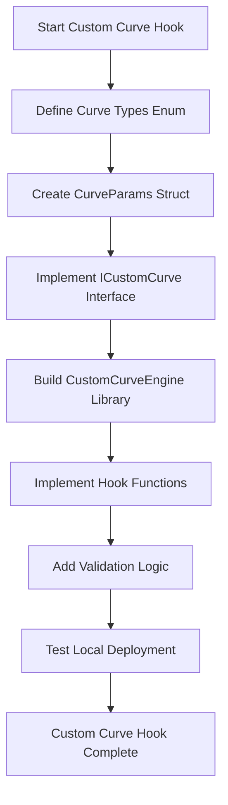
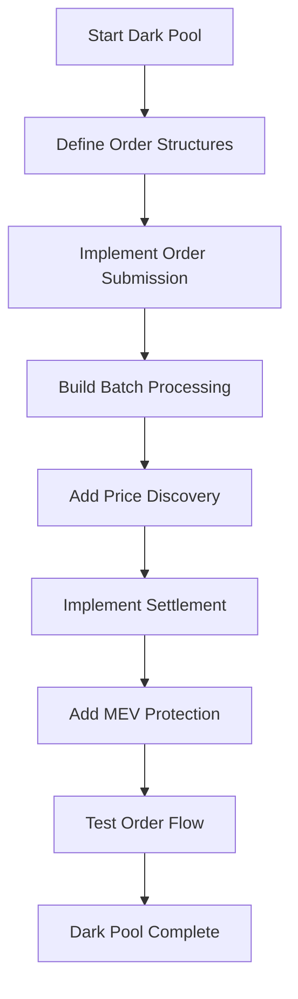
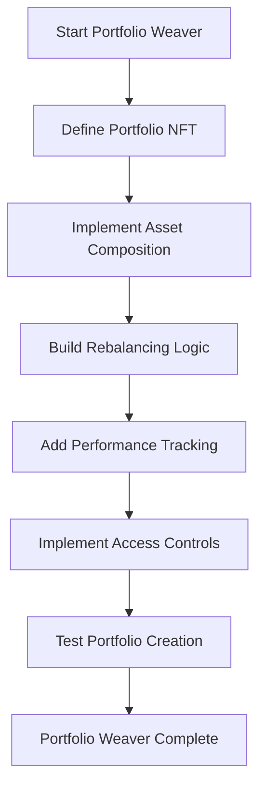
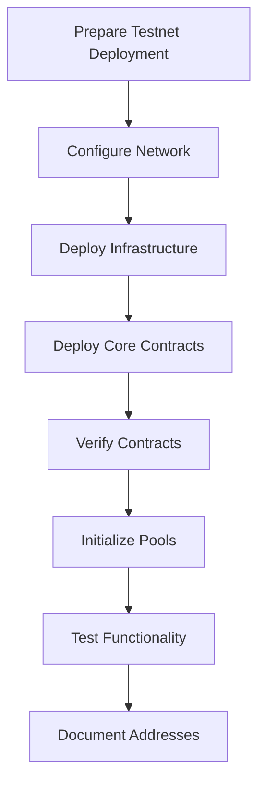
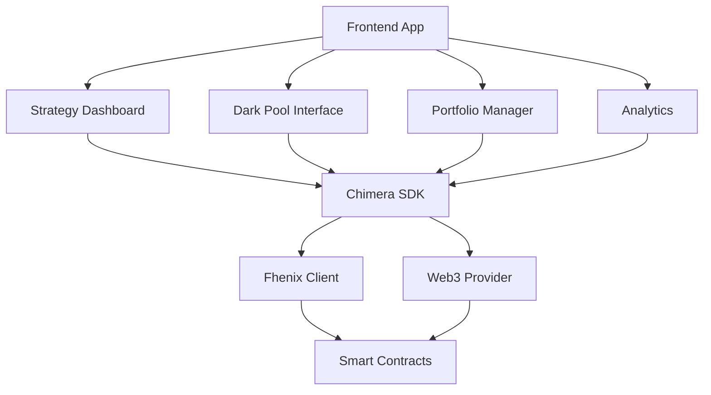
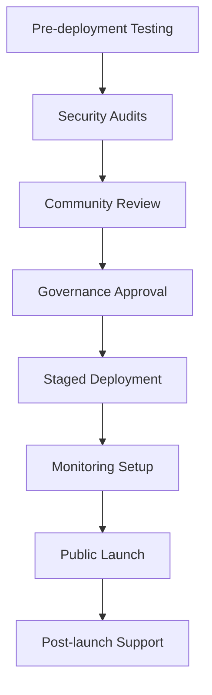
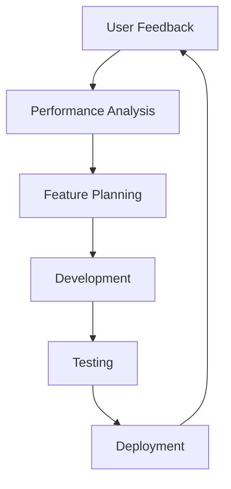

# Chimera Protocol - Implementation Flow Guide

## 🚀 Complete Development Workflow

This document provides a comprehensive step-by-step guide for implementing Chimera Protocol from initial setup to production deployment.

---

## 📋 Table of Contents

1. [Development Environment Setup](#1-development-environment-setup)
2. [Core Contract Development](#2-core-contract-development)
3. [Testing Framework](#3-testing-framework)
4. [Integration & Deployment](#4-integration--deployment)
5. [Frontend Development](#5-frontend-development)
6. [Production Launch](#6-production-launch)

---

## 1. Development Environment Setup

### 1.1 Prerequisites Installation

```bash
# Install Node.js 18+ and npm 8+
curl -fsSL https://deb.nodesource.com/setup_18.x | sudo -E bash -
sudo apt-get install -y nodejs

# Install foundry
curl -L https://foundry.paradigm.xyz | bash
foundryup

# Install git and essential tools
sudo apt-get install git curl wget
```

### 1.2 Project Initialization

```bash
# Clone the repository
git clone https://github.com/ChimeraProtocol/chimera-core.git
cd chimera-core

# Install dependencies
npm install

# Set up environment variables
cp .env.example .env
# Edit .env with your configuration

# Initialize git hooks and pre-commit tools
npm run setup:dev
```

### 1.3 Fhenix Development Environment

```bash
# Install Fhenix CLI
npm install -g @fhenixprotocol/fhenix-cli

# Initialize Fhenix project
fhenix init

# Configure Fhenix network
fhenix config --network helium --rpc-url https://api.helium.fhenix.zone
```

### 1.4 Verification of Setup

```bash
# Verify installations
node --version        # Should be 18+
npm --version         # Should be 8+
forge --version       # Should show foundry version
fhenix --version      # Should show fhenix CLI version

# Test compilation
npm run build
echo "✅ Environment setup complete!"
```

---

## 2. Core Contract Development

### 2.1 Phase 1: Foundation Contracts

#### 2.1.1 Custom Curve Hook Implementation



**Step-by-step Implementation:**

1. **Interface Definition** (`contracts/interfaces/hooks/ICustomCurve.sol`):
```solidity
interface ICustomCurve {
    enum CurveType { Linear, Exponential, Sigmoid, Logarithmic, Polynomial, Custom }
    
    struct CurveParams {
        CurveType curveType;                // Curve type (Linear, Exponential, etc.)
        FheUint64[] encryptedCoefficients; // Encrypted curve parameters
        FheBytes32 formulaHash;            // Formula identification hash
        uint256 maxLeverage;               // Maximum leverage allowed
        uint256 volatilityFactor;          // Volatility adjustment factor (basis points)
        uint256 minLiquidity;              // Minimum liquidity for curve integrity
        uint256 maxSlippage;               // Maximum slippage allowed (basis points)
        uint256 timeDecayRate;             // Time decay rate for options (basis points/day)
        bool isActive;                     // Curve activation status
    }
    
    struct CurveState {
        uint256 lastUpdateTime;            // Last state update timestamp
        uint256 totalLiquidity;            // Total liquidity in the pool
        uint256 reserves0;                 // Token0 reserves
        uint256 reserves1;                 // Token1 reserves
        uint256 volume24h;                 // 24-hour trading volume
        uint256 feeAccumulated;            // Accumulated fees
        bool isActive;                     // State activation status
    }
    
    function setCurveParameters(...) external;
    function calculatePrice(...) external view returns (FheUint64);
}
```

2. **Engine Library** (`contracts/libraries/curves/CustomCurveEngine.sol`):
```solidity
library CustomCurveEngine {
    function computeLinearPrice(...) internal view returns (FheUint64) {
        // Linear: P(x) = a × x + b
    }
    
    function computeExponentialPrice(...) internal view returns (FheUint64) {
        // Exponential: P(x) = a × e^(b × x)
    }
    
    // ... other curve implementations
}
```

3. **Main Hook Contract** (`contracts/hooks/CustomCurveHook.sol`):
```solidity
contract CustomCurveHook is BaseHook, ICustomCurve {
    using CustomCurveEngine for CurveParams;
    
    mapping(PoolId => CurveParams) public poolCurves;
    mapping(PoolId => CurveState) public curveStates;
    
    // ✅ COMPLETE HOOK PERMISSIONS
    function getHookPermissions() public pure override returns (Hooks.Permissions memory) {
        return Hooks.Permissions({
            beforeInitialize: true,     // Setup curve parameters
            afterInitialize: true,      // Validate configuration
            beforeAddLiquidity: true,   // ✅ Curve constraint validation
            afterAddLiquidity: true,    // ✅ State updates + BalanceDelta
            beforeRemoveLiquidity: true, // ✅ Integrity validation
            afterRemoveLiquidity: true,  // ✅ Maintenance + BalanceDelta
            beforeSwap: true,           // ✅ Custom price + BeforeSwapDelta
            afterSwap: true,            // ✅ State updates + fee adjustment
            beforeDonate: false,
            afterDonate: false
        });
    }
    
    // ✅ DELTA RETURN FUNCTIONS
    function afterAddLiquidity(...) external override returns (bytes4, BalanceDelta) {
        // Update curve state and return liquidity adjustments
    }
    
    function afterRemoveLiquidity(...) external override returns (bytes4, BalanceDelta) {
        // Maintain curve integrity and return removal adjustments
    }
    
    function beforeSwap(...) external override returns (bytes4, BeforeSwapDelta, uint24) {
        // Custom price calculation with swap modifications
    }
    
    function afterSwap(...) external override returns (bytes4, int128) {
        // State updates with fee adjustments
    }
}
```

#### 2.1.2 Testing Custom Curve Hook

```bash
# Create test file
touch test/unit/hooks/CustomCurveHook.test.js

# Run specific tests
npx hardhat test test/unit/hooks/CustomCurveHook.test.js

# Test with different curve types
npm run test:curves
```

### 2.2 Phase 2: Dark Pool Engine

#### 2.2.1 Dark Pool Implementation Flow



**Implementation Steps:**

1. **Order Structure Definition**:
```solidity
struct ConfidentialOrder {
    FheUint64 amountIn;
    FheUint64 minAmountOut;
    FheUint64 maxSlippage;
    FheBytes32 orderType;
    address trader;
    uint256 deadline;
    bool isActive;
}
```

2. **Batch Processing Logic**:
```solidity
function executeBatch() external {
    uint256[] memory orderIds = collectActiveOrders();
    FheUint64 uniformPrice = calculateUniformPrice(orderIds);
    executeOrdersAtUniformPrice(orderIds, uniformPrice);
}
```

3. **MEV Protection Implementation**:
```solidity
function submitConfidentialOrder(
    bytes calldata encAmountIn,
    bytes calldata encMinAmountOut,
    // ... other encrypted parameters
) external returns (uint256 orderId) {
    // Store encrypted order data
    // Trigger batch execution if needed
}
```

### 2.3 Phase 3: ZK-Portfolio Weaver

#### 2.3.1 Portfolio Implementation Flow



**Key Components:**

1. **Portfolio NFT Structure**:
```solidity
struct ZKPortfolio {
    uint256 tokenId;
    FheUint64[] assetWeights;
    address[] assetAddresses;
    FheBytes32 rebalanceStrategy;
}
```

2. **Confidential Rebalancing**:
```solidity
function executeConfidentialRebalance(uint256 tokenId) internal {
    // Calculate target allocations using encrypted weights
    // Execute trades to maintain portfolio balance
}
```

---

## 3. Testing Framework

### 3.1 Test Environment Setup

```bash
# Install testing dependencies
npm install --save-dev @fhenixprotocol/fhenix-hardhat-plugin
npm install --save-dev @fhenixprotocol/fhenix-js

# Set up test configuration
cp test/config/test.config.example.js test/config/test.config.js
```

### 3.2 Test Structure

```
test/
├── unit/                          # Unit tests
│   ├── hooks/
│   │   ├── CustomCurveHook.test.js
│   │   ├── EncryptedAlphaHook.test.js
│   │   └── BaseChimeraHook.test.js
│   ├── darkpool/
│   │   ├── DarkPoolEngine.test.js
│   │   └── BatchProcessor.test.js
│   └── weaver/
│       └── StrategyWeaver.test.js
├── integration/                   # Integration tests
│   ├── full-flow.test.js
│   └── cross-contract.test.js
├── security/                      # Security tests
│   ├── attack-vectors.test.js
│   └── access-control.test.js
└── helpers/                       # Test utilities
    ├── setup.js
    ├── fhenix-helpers.js
    └── mock-data.js
```

### 3.3 Test Execution Workflow

```bash
# Run all tests
npm test

# Run specific test categories
npm run test:unit
npm run test:integration
npm run test:security

# Run tests with coverage
npm run test:coverage

# Run performance tests
npm run test:performance
```

### 3.4 Fhenix-Specific Testing

```javascript
const { FhenixClient } = require('@fhenixprotocol/fhenix.js');

describe('Encrypted Operations', function() {
    let fhenixClient;
    
    before(async function() {
        fhenixClient = new FhenixClient({ provider: ethers.provider });
    });
    
    it('Should encrypt and process parameters', async function() {
        const encryptedValue = await fhenixClient.encrypt_uint64(1000);
        const result = await contract.processEncrypted(encryptedValue);
        expect(result).to.not.be.reverted;
    });
});
```

---

## 4. Integration & Deployment

### 4.1 Local Development Deployment

```bash
# Start local Hardhat network
npx hardhat node

# Deploy contracts locally
npm run deploy:local

# Verify deployment
npm run verify:local
```

### 4.2 Testnet Deployment Flow



#### 4.2.1 Fhenix Helium Testnet

```bash
# Configure Fhenix Helium network
fhenix config --network helium

# Deploy to testnet
npm run deploy:testnet

# Verify contracts
npm run verify:testnet

# Test basic functionality
npm run test:testnet
```

#### 4.2.2 Contract Verification

```bash
# Verify CustomCurveHook
npx hardhat verify --network fhenixHelium <CONTRACT_ADDRESS> <CONSTRUCTOR_ARGS>

# Verify DarkPoolEngine
npx hardhat verify --network fhenixHelium <CONTRACT_ADDRESS>

# Verify all contracts
npm run verify:all
```

### 4.3 Integration Testing

```bash
# Run integration test suite
npm run test:integration

# Test cross-contract interactions
npm run test:cross-contract

# Performance testing
npm run test:performance

# Security testing
npm run test:security
```

---

## 5. Frontend Development

### 5.1 Frontend Architecture



### 5.2 SDK Development

#### 5.2.1 Core SDK Structure (`sdk/src/core/ChimeraClient.ts`):

```typescript
export class ChimeraClient {
    private fhenixClient: FhenixClient;
    private provider: Provider;
    
    constructor(config: ChimeraConfig) {
        this.fhenixClient = new FhenixClient(config.fhenix);
        this.provider = config.provider;
    }
    
    async createStrategy(params: StrategyParams): Promise<StrategyResult> {
        // Encrypt parameters
        const encryptedParams = await this.encryptParams(params);
        
        // Deploy strategy
        return this.deployStrategy(encryptedParams);
    }
    
    async submitDarkPoolOrder(order: OrderParams): Promise<OrderResult> {
        // Encrypt order details
        const encryptedOrder = await this.encryptOrder(order);
        
        // Submit to dark pool
        return this.darkPoolEngine.submitOrder(encryptedOrder);
    }
}
```

#### 5.2.2 Strategy Manager (`sdk/src/core/StrategyManager.ts`):

```typescript
export class StrategyManager {
    async deployLinearStrategy(params: LinearStrategyParams): Promise<string> {
        const encryptedCoeffs = await Promise.all([
            this.fhenixClient.encrypt_uint64(params.slope),
            this.fhenixClient.encrypt_uint64(params.intercept)
        ]);
        
        return this.customCurveHook.setCurveParameters(
            params.poolId,
            CurveType.Linear,
            encryptedCoeffs,
            params.formulaHash,
            params.maxLeverage,
            params.volatilityFactor
        );
    }
}
```

### 5.3 Frontend Components

#### 5.3.1 React Component Structure:

```typescript
// components/StrategyDashboard/StrategyCreator.tsx
export const StrategyCreator: React.FC = () => {
    const { createStrategy } = useChimera();
    
    const handleStrategySubmission = async (formData: StrategyFormData) => {
        try {
            const result = await createStrategy({
                curveType: formData.curveType,
                parameters: formData.parameters,
                maxLeverage: formData.maxLeverage
            });
            
            setSuccess(`Strategy created: ${result.transactionHash}`);
        } catch (error) {
            setError(`Failed to create strategy: ${error.message}`);
        }
    };
    
    return (
        <StrategyForm onSubmit={handleStrategySubmission} />
    );
};
```

#### 5.3.2 Dark Pool Interface:

```typescript
// components/DarkPoolInterface/OrderForm.tsx
export const OrderForm: React.FC = () => {
    const { submitOrder } = useDarkPool();
    
    const handleOrderSubmission = async (orderData: OrderFormData) => {
        const result = await submitOrder({
            amountIn: orderData.amountIn,
            minAmountOut: orderData.minAmountOut,
            tokenIn: orderData.tokenIn,
            tokenOut: orderData.tokenOut,
            deadline: orderData.deadline
        });
        
        setOrderId(result.orderId);
    };
    
    return (
        <DarkPoolForm onSubmit={handleOrderSubmission} />
    );
};
```

### 5.4 Frontend Development Workflow

```bash
# Set up frontend environment
cd frontend
npm install

# Start development server
npm run dev

# Build for production
npm run build

# Test frontend
npm run test

# Run end-to-end tests
npm run test:e2e
```

---

## 6. Production Launch

### 6.1 Pre-Production Checklist

#### 6.1.1 Security Audit Preparation

```bash
# Generate audit report
npm run audit:prepare

# Flatten contracts for audit
npm run flatten:contracts

# Generate documentation
npm run docs:generate

# Security testing
npm run test:security
```

#### 6.1.2 Performance Optimization

```bash
# Gas optimization analysis
npm run analyze:gas

# Performance profiling
npm run profile:performance

# Load testing
npm run test:load

# Optimize for production
npm run optimize:production
```

### 6.2 Mainnet Deployment Strategy



#### 6.2.1 Staged Deployment Process

1. **Infrastructure Deployment**:
```bash
# Deploy governance contracts
npm run deploy:governance

# Deploy core infrastructure
npm run deploy:infrastructure

# Set up monitoring
npm run setup:monitoring
```

2. **Core Protocol Deployment**:
```bash
# Deploy hooks
npm run deploy:hooks

# Deploy dark pool
npm run deploy:darkpool

# Deploy portfolio weaver
npm run deploy:weaver
```

3. **Integration and Testing**:
```bash
# Integration testing
npm run test:mainnet-integration

# Performance validation
npm run validate:performance

# Security verification
npm run verify:security
```

### 6.3 Launch Coordination

#### 6.3.1 Launch Timeline

| Phase | Duration | Activities |
|-------|----------|------------|
| **Pre-launch** | 2 weeks | Final testing, documentation, marketing |
| **Soft Launch** | 1 week | Limited user access, monitoring |
| **Public Launch** | Ongoing | Full public access, support |
| **Post-launch** | 4 weeks | Performance monitoring, optimization |

#### 6.3.2 Launch Day Checklist

```bash
# Pre-launch verification
npm run verify:all-systems

# Enable public access
npm run enable:public-access

# Start monitoring
npm run start:monitoring

# Begin user support
npm run start:support-systems

# Announce launch
echo "🚀 Chimera Protocol is live!"
```

### 6.4 Post-Launch Operations

#### 6.4.1 Monitoring and Maintenance

```bash
# Real-time monitoring
npm run monitor:realtime

# Performance tracking
npm run track:performance

# User analytics
npm run analyze:usage

# Security monitoring
npm run monitor:security
```

#### 6.4.2 Continuous Improvement



---

## 7. Development Best Practices

### 7.1 Code Quality Standards

#### 7.1.1 Solidity Best Practices

```solidity
// ✅ Good: Clear function documentation
/**
 * @notice Calculate price using custom curve parameters
 * @param poolId The identifier of the pool
 * @param reserves0 Current reserves of token0
 * @param reserves1 Current reserves of token1
 * @param zeroForOne Direction of the swap
 * @return Calculated price as encrypted value
 */
function calculatePrice(
    PoolId poolId,
    uint256 reserves0,
    uint256 reserves1,
    bool zeroForOne
) external view returns (FheUint64) {
    // Implementation
}

// ✅ Good: Input validation
require(poolId != PoolId.wrap(0), "Invalid pool ID");
require(reserves0 > 0 && reserves1 > 0, "Invalid reserves");

// ✅ Good: Gas optimization
uint256 constant PRECISION = 1e18;
```

#### 7.1.2 TypeScript Best Practices

```typescript
// ✅ Good: Type safety
interface StrategyParams {
    readonly curveType: CurveType;
    readonly parameters: readonly number[];
    readonly maxLeverage: number;
    readonly volatilityFactor: number;
}

// ✅ Good: Error handling
async function createStrategy(params: StrategyParams): Promise<StrategyResult> {
    try {
        const encryptedParams = await this.encryptParams(params);
        return await this.deployStrategy(encryptedParams);
    } catch (error) {
        if (error instanceof ChimeraError) {
            throw error;
        }
        throw new ChimeraError(`Strategy creation failed: ${error.message}`);
    }
}
```

### 7.2 Testing Standards

#### 7.2.1 Test Coverage Requirements

- **Unit Tests**: >95% line coverage
- **Integration Tests**: All critical user flows
- **Security Tests**: All attack vectors covered
- **Performance Tests**: Gas usage optimization

#### 7.2.2 Test Organization

```javascript
describe('CustomCurveHook', function() {
    describe('Constructor', function() {
        // Constructor tests
    });
    
    describe('setCurveParameters', function() {
        context('when called by authorized user', function() {
            // Success cases
        });
        
        context('when called by unauthorized user', function() {
            // Failure cases
        });
    });
});
```

### 7.3 Documentation Standards

#### 7.3.1 Code Documentation

```solidity
/// @title Custom Curve Hook
/// @author Chimera Protocol Team
/// @notice Enables pools to use arbitrary mathematical functions for price discovery
/// @dev Replaces standard x*y=k with programmable bonding curves
contract CustomCurveHook is BaseHook, ICustomCurve {
    // Implementation
}
```

#### 7.3.2 API Documentation

```typescript
/**
 * @class ChimeraClient
 * @description Main client for interacting with Chimera Protocol
 * @example
 * ```typescript
 * const client = new ChimeraClient({
 *   provider: window.ethereum,
 *   network: 'fhenixHelium'
 * });
 * 
 * const strategy = await client.createStrategy({
 *   curveType: CurveType.Linear,
 *   parameters: [1000, 500],
 *   maxLeverage: 10
 * });
 * ```
 */
```

---

## 8. Troubleshooting Guide

### 8.1 Common Development Issues

#### 8.1.1 Fhenix Integration Issues

**Problem**: FHE operations failing
```bash
Error: FHE operation failed: invalid encrypted value
```

**Solution**:
```javascript
// Ensure proper encryption
const encryptedValue = await fhenixClient.encrypt_uint64(value);

// Verify encryption before use
if (!encryptedValue || encryptedValue.length === 0) {
    throw new Error('Encryption failed');
}
```

#### 8.1.2 Gas Estimation Issues

**Problem**: Gas estimation too high
```bash
Error: Transaction would exceed block gas limit
```

**Solution**:
```solidity
// Use batch operations
function batchOperations(bytes[] calldata operations) external {
    for (uint256 i = 0; i < operations.length; i++) {
        // Process operations efficiently
    }
}
```

### 8.2 Deployment Issues

#### 8.2.1 Contract Verification Failures

**Problem**: Contract verification failing on block explorer

**Solution**:
```bash
# Flatten contracts
npx hardhat flatten contracts/hooks/CustomCurveHook.sol > flattened.sol

# Manual verification with constructor args
npx hardhat verify --constructor-args arguments.js <CONTRACT_ADDRESS>
```

#### 8.2.2 Network Configuration Issues

**Problem**: Wrong network configuration

**Solution**:
```javascript
// hardhat.config.js
networks: {
    fhenixHelium: {
        url: "https://api.helium.fhenix.zone",
        accounts: [process.env.PRIVATE_KEY],
        chainId: 8008135,
        gasPrice: 1000000000, // 1 gwei
        timeout: 60000
    }
}
```

---

## 9. Performance Monitoring

### 9.1 Key Metrics to Track

#### 9.1.1 Protocol Metrics

- **Total Value Locked (TVL)**
- **Daily Active Users (DAU)**
- **Transaction Volume**
- **Number of Active Strategies**
- **Average Gas Cost per Transaction**

#### 9.1.2 Technical Metrics

- **Transaction Success Rate**
- **Average Confirmation Time**
- **FHE Operation Performance**
- **Dark Pool Batch Efficiency**
- **Contract Upgrade Success Rate**

### 9.2 Monitoring Tools Setup

```bash
# Set up Grafana dashboard
npm run setup:grafana

# Configure Prometheus metrics
npm run setup:prometheus

# Enable real-time alerts
npm run setup:alerts

# Start monitoring
npm run start:monitoring
```

---

## 10. Conclusion

This implementation flow guide provides a comprehensive roadmap for developing Chimera Protocol from initial setup to production deployment. The modular approach ensures that each component can be developed, tested, and deployed independently while maintaining system integrity.

Key success factors include:

- **Thorough Testing**: Comprehensive test coverage at all levels
- **Security Focus**: Security considerations at every development stage  
- **Performance Optimization**: Continuous optimization for gas efficiency
- **Documentation**: Clear documentation for developers and users
- **Monitoring**: Real-time monitoring and alerting systems

By following this implementation flow, development teams can successfully build and deploy the world's first confidential AMM, revolutionizing DeFi through privacy-preserving financial engineering.

---

**Next Steps:**
1. Set up development environment
2. Begin with Custom Curve Hook implementation
3. Follow testing protocols for each component
4. Proceed through deployment phases systematically
5. Monitor and optimize post-deployment

*For specific implementation details, refer to the [Architecture Documentation](ARCHITECTURE.md) and [Developer Guide](DEVELOPER_GUIDE.md).*
