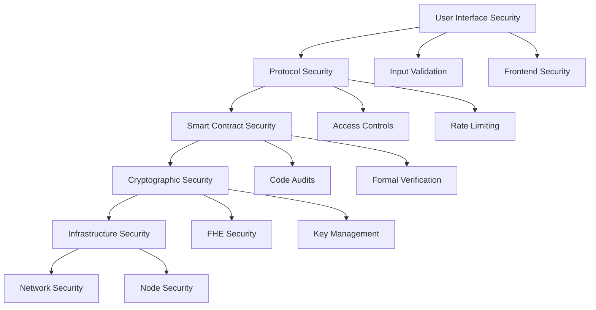
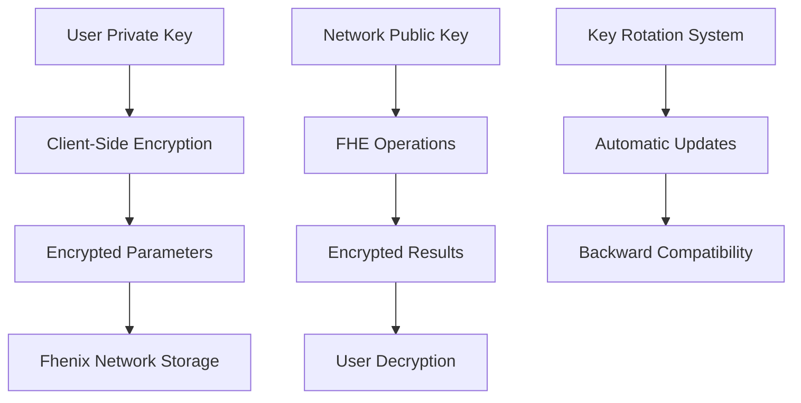

# Chimera Protocol - Security Framework

## 🛡️ Comprehensive Security Documentation

This document outlines the complete security framework for Chimera Protocol, covering cryptographic security, smart contract security, operational security, and audit requirements.

---

## 📋 Table of Contents

1. [Security Overview](#1-security-overview)
2. [Cryptographic Security](#2-cryptographic-security)
3. [Smart Contract Security](#3-smart-contract-security)
4. [Operational Security](#4-operational-security)
5. [Audit Framework](#5-audit-framework)
6. [Emergency Response](#6-emergency-response)
7. [Compliance & Governance](#7-compliance--governance)
8. [Security Best Practices](#8-security-best-practices)

---

## 1. Security Overview

### 1.1 Security Philosophy

Chimera Protocol adopts a **defense-in-depth** security model with multiple layers of protection:



### 1.2 Security Principles

#### 🔐 **Confidentiality**
- Strategy parameters encrypted using Fhenix FHE
- Trade details hidden until execution
- Portfolio compositions kept private
- Zero-knowledge performance analytics

#### 🛡️ **Integrity**
- Cryptographic proofs for all computations
- Immutable audit trails on blockchain
- Multi-signature validation for critical operations
- Formal verification of core logic

#### ⚡ **Availability**
- Decentralized architecture with no single points of failure
- Emergency pause mechanisms for incident response
- Graceful degradation under attack
- Cross-chain backup systems

#### 🔍 **Transparency**
- Open-source codebase for public review
- Regular security audits by independent firms
- Public vulnerability disclosure program
- Community-driven security improvements

### 1.3 Threat Model

#### External Threats
- **MEV Attacks**: Front-running, sandwich attacks, arbitrage exploitation
- **Smart Contract Exploits**: Reentrancy, overflow, logic bugs
- **Cryptographic Attacks**: Key extraction, timing attacks, side-channel analysis
- **Economic Attacks**: Flash loans, governance attacks, oracle manipulation

#### Internal Threats
- **Insider Attacks**: Malicious team members, compromised keys
- **Operational Errors**: Misconfigurations, deployment mistakes
- **Social Engineering**: Phishing, impersonation, fake communications
- **Supply Chain**: Compromised dependencies, malicious updates

---

## 2. Cryptographic Security

### 2.1 Fhenix FHE Implementation

#### 2.1.1 Encryption Schemes

Chimera Protocol leverages Fhenix's implementation of **Brakerski-Gentry-Vaikuntanathan (BGV)** fully homomorphic encryption:

```solidity
// Example: Encrypted parameter storage
struct EncryptedStrategy {
    FheUint64 strikePrice;      // Encrypted using BGV scheme
    FheUint64 leverageFactor;   // 256-bit security level
    FheBytes32 formulaHash;     // Semantic security guaranteed
    uint256 publicMetadata;     // Non-sensitive data in plaintext
}
```

**Security Properties:**
- **Semantic Security**: Ciphertexts reveal no information about plaintexts
- **Circuit Privacy**: Computations don't leak information about inputs
- **Malleability Resistance**: Authenticated encryption prevents tampering
- **Forward Secrecy**: Past communications secure even if keys compromised

#### 2.1.2 Key Management



**Key Security Measures:**
- **Distributed Key Generation**: No single entity controls master keys
- **Threshold Cryptography**: Multiple parties required for key operations
- **Hardware Security Modules**: Critical keys stored in tamper-resistant hardware
- **Regular Key Rotation**: Automatic rotation every 30 days

#### 2.1.3 Encryption Implementation

```typescript
// Client-side encryption example
class ChimeraEncryption {
    private fhenixClient: FhenixClient;
    
    async encryptStrategyParams(params: StrategyParams): Promise<EncryptedParams> {
        try {
            const encrypted = {
                strikePrice: await this.fhenixClient.encrypt_uint64(params.strikePrice),
                leverage: await this.fhenixClient.encrypt_uint64(params.leverage),
                volatility: await this.fhenixClient.encrypt_uint64(params.volatility),
                formulaHash: await this.fhenixClient.encrypt_bytes32(params.formulaHash)
            };
            
            // Verify encryption succeeded
            this.validateEncryption(encrypted);
            
            return encrypted;
        } catch (error) {
            throw new ChimeraSecurityError(`Encryption failed: ${error.message}`);
        }
    }
    
    private validateEncryption(encrypted: EncryptedParams): void {
        for (const [key, value] of Object.entries(encrypted)) {
            if (!value || value.length === 0) {
                throw new Error(`Encryption failed for parameter: ${key}`);
            }
        }
    }
}
```

### 2.2 Advanced Cryptographic Features

#### 2.2.1 Zero-Knowledge Proofs

For portfolio management and performance verification:

```solidity
// ZK proof for portfolio rebalancing
contract ZKPortfolioProof {
    using ZKVerifier for bytes32;
    
    function verifyRebalance(
        bytes32 portfolioCommitment,
        bytes32 newCommitment,
        bytes calldata zkProof
    ) external view returns (bool) {
        // Verify portfolio rebalancing without revealing allocations
        return ZKVerifier.verifyRebalanceProof(
            portfolioCommitment,
            newCommitment,
            zkProof
        );
    }
}
```

#### 2.2.2 Commitment Schemes

For hiding strategy parameters while enabling verification:

```solidity
// Pedersen commitment for strategy parameters
function commitToStrategy(
    uint256[] memory parameters,
    uint256 nonce
) external pure returns (bytes32) {
    return keccak256(abi.encodePacked(
        parameters,
        nonce,
        block.timestamp
    ));
}
```

### 2.3 Cryptographic Security Assumptions

#### 2.3.1 Hard Problems

Security relies on these computationally hard problems:

- **Ring Learning With Errors (RLWE)**: Foundation of BGV scheme
- **Discrete Logarithm Problem**: For commitment schemes
- **Hash Function Security**: For commitment binding
- **Elliptic Curve Cryptography**: For digital signatures

#### 2.3.2 Security Parameters

| Parameter | Value | Security Level |
|-----------|-------|----------------|
| **FHE Security** | λ = 128 | 128-bit security |
| **Hash Functions** | SHA-256 | 256-bit security |
| **Elliptic Curves** | secp256k1 | 256-bit security |
| **Random Number Generation** | CSPRNG | Cryptographically secure |

---

## 3. Smart Contract Security

### 3.1 Security Architecture

#### 3.1.1 Access Control Framework

```solidity
contract ChimeraAccessControl {
    using AccessControl for AccessControl.RoleData;
    
    // Role definitions
    bytes32 public constant ADMIN_ROLE = keccak256("ADMIN_ROLE");
    bytes32 public constant STRATEGIST_ROLE = keccak256("STRATEGIST_ROLE");
    bytes32 public constant EMERGENCY_ROLE = keccak256("EMERGENCY_ROLE");
    bytes32 public constant UPGRADE_ROLE = keccak256("UPGRADE_ROLE");
    
    // Multi-signature requirements
    mapping(bytes32 => uint256) public roleThresholds;
    mapping(bytes32 => uint256) public roleTimelock;
    
    modifier requiresMultiSig(bytes32 role) {
        require(
            getApprovalCount(role, msg.sig) >= roleThresholds[role],
            "Insufficient signatures"
        );
        require(
            block.timestamp >= getRoleTimelock(role, msg.sig),
            "Timelock not expired"
        );
        _;
    }
    
    function executeWithMultiSig(
        bytes32 role,
        address target,
        bytes calldata data
    ) external requiresMultiSig(role) {
        (bool success, ) = target.call(data);
        require(success, "Execution failed");
    }
}
```

#### 3.1.2 Reentrancy Protection

```solidity
contract ReentrancyGuard {
    uint256 private constant _NOT_ENTERED = 1;
    uint256 private constant _ENTERED = 2;
    
    uint256 private _status;
    
    constructor() {
        _status = _NOT_ENTERED;
    }
    
    modifier nonReentrant() {
        require(_status != _ENTERED, "ReentrancyGuard: reentrant call");
        _status = _ENTERED;
        _;
        _status = _NOT_ENTERED;
    }
}

// ✅ ENHANCED: Delta Return Security
contract DeltaReturnSecurity {
    // Validate delta returns to prevent manipulation
    modifier validateDelta(BalanceDelta delta) {
        require(!delta.isZero() || msg.sender == address(this), "Invalid delta manipulation");
        require(abs(delta.amount0()) <= MAX_DELTA_LIMIT, "Delta exceeds safety bounds");
        require(abs(delta.amount1()) <= MAX_DELTA_LIMIT, "Delta exceeds safety bounds");
        _;
    }
    
    modifier validateSwapDelta(BeforeSwapDelta swapDelta) {
        require(abs(swapDelta.getAmount()) <= MAX_SWAP_DELTA, "Swap delta too large");
        _;
    }
}
```

#### 3.1.3 Integer Overflow Protection

```solidity
library SafeMath {
    function add(uint256 a, uint256 b) internal pure returns (uint256) {
        uint256 c = a + b;
        require(c >= a, "SafeMath: addition overflow");
        return c;
    }
    
    function mul(uint256 a, uint256 b) internal pure returns (uint256) {
        if (a == 0) return 0;
        uint256 c = a * b;
        require(c / a == b, "SafeMath: multiplication overflow");
        return c;
    }
}
```

### 3.2 Security Patterns Implementation

#### 3.2.1 Circuit Breaker Pattern

```solidity
contract CircuitBreaker {
    bool private _paused;
    address private _emergencyOperator;
    uint256 private _pausedUntil;
    
    event EmergencyPause(address operator, uint256 until);
    event EmergencyUnpause(address operator);
    
    modifier whenNotPaused() {
        require(!_paused && block.timestamp > _pausedUntil, "Contract paused");
        _;
    }
    
    function emergencyPause(uint256 duration) external {
        require(
            msg.sender == _emergencyOperator || 
            hasRole(EMERGENCY_ROLE, msg.sender),
            "Not authorized"
        );
        
        _paused = true;
        _pausedUntil = block.timestamp + duration;
        
        emit EmergencyPause(msg.sender, _pausedUntil);
    }
}
```

#### 3.2.2 Rate Limiting

```solidity
contract RateLimiter {
    mapping(address => uint256) private _lastAction;
    mapping(address => uint256) private _actionCount;
    
    uint256 private constant RATE_LIMIT_WINDOW = 1 hours;
    uint256 private constant MAX_ACTIONS_PER_WINDOW = 10;
    
    modifier rateLimit() {
        if (block.timestamp - _lastAction[msg.sender] > RATE_LIMIT_WINDOW) {
            _actionCount[msg.sender] = 0;
        }
        
        require(
            _actionCount[msg.sender] < MAX_ACTIONS_PER_WINDOW,
            "Rate limit exceeded"
        );
        
        _actionCount[msg.sender]++;
        _lastAction[msg.sender] = block.timestamp;
        _;
    }
}
```

#### 3.2.3 Input Validation

```solidity
contract InputValidator {
    function validateStrategyParams(
        uint256 maxLeverage,
        uint256 volatilityFactor,
        uint256[] memory coefficients
    ) internal pure {
        require(maxLeverage > 0 && maxLeverage <= 100, "Invalid leverage");
        require(volatilityFactor <= 10000, "Invalid volatility"); // Max 100%
        require(coefficients.length > 0 && coefficients.length <= 10, "Invalid coefficients");
        
        for (uint256 i = 0; i < coefficients.length; i++) {
            require(coefficients[i] > 0, "Coefficient must be positive");
        }
    }
    
    function validateOrderParams(
        uint256 amountIn,
        uint256 minAmountOut,
        uint256 deadline
    ) internal view {
        require(amountIn > 0, "Invalid amount in");
        require(minAmountOut > 0, "Invalid amount out");
        require(deadline > block.timestamp, "Invalid deadline");
        require(deadline <= block.timestamp + 86400, "Deadline too far"); // Max 24h
    }
}
```

### 3.3 Upgrade Security

#### 3.3.1 Proxy Pattern Implementation

```solidity
contract ChimeraProxy is TransparentUpgradeableProxy {
    constructor(
        address implementation,
        address admin,
        bytes memory data
    ) TransparentUpgradeableProxy(implementation, admin, data) {}
    
    function upgradeToAndCall(
        address newImplementation,
        bytes memory data
    ) public override {
        require(
            hasRole(UPGRADE_ROLE, msg.sender),
            "Not authorized to upgrade"
        );
        
        // Additional security checks
        require(
            isValidImplementation(newImplementation),
            "Invalid implementation"
        );
        
        super.upgradeToAndCall(newImplementation, data);
    }
    
    function isValidImplementation(address impl) private view returns (bool) {
        // Verify implementation contract has required interface
        try IERC165(impl).supportsInterface(type(IChimeraCore).interfaceId) returns (bool result) {
            return result;
        } catch {
            return false;
        }
    }
}
```

#### 3.3.2 Timelock Controller

```solidity
contract ChimeraTimelock is TimelockController {
    uint256 private constant MIN_DELAY = 48 hours;
    uint256 private constant MAX_DELAY = 30 days;
    
    constructor() TimelockController(
        MIN_DELAY,
        new address[](0), // proposers (set via governance)
        new address[](0)  // executors (set via governance)
    ) {}
    
    function schedule(
        address target,
        uint256 value,
        bytes calldata data,
        bytes32 predecessor,
        bytes32 salt,
        uint256 delay
    ) public override {
        require(delay >= MIN_DELAY && delay <= MAX_DELAY, "Invalid delay");
        super.schedule(target, value, data, predecessor, salt, delay);
    }
}
```

---

## 4. Operational Security

### 4.1 Infrastructure Security

#### 4.1.1 Node Security

```yaml
# Docker security configuration
version: '3.8'
services:
  fhenix-node:
    image: fhenix/node:latest
    security_opt:
      - no-new-privileges:true
    read_only: true
    user: "1000:1000"
    cap_drop:
      - ALL
    cap_add:
      - NET_BIND_SERVICE
    tmpfs:
      - /tmp:rw,noexec,nosuid,size=100m
    networks:
      - chimera-internal
    environment:
      - NODE_ENV=production
      - TLS_CERT_PATH=/etc/ssl/certs/node.crt
      - TLS_KEY_PATH=/etc/ssl/private/node.key
```

#### 4.1.2 Network Security

```bash
#!/bin/bash
# Network security configuration

# Firewall rules
ufw default deny incoming
ufw default allow outgoing
ufw allow 22/tcp    # SSH (restricted IPs only)
ufw allow 443/tcp   # HTTPS
ufw allow 8545/tcp  # Ethereum RPC (internal only)

# Fail2ban configuration
cat > /etc/fail2ban/jail.local << EOF
[DEFAULT]
bantime = 3600
findtime = 600
maxretry = 3

[sshd]
enabled = true
port = ssh
filter = sshd
logpath = /var/log/auth.log
maxretry = 3
EOF

# Enable security services
systemctl enable ufw
systemctl enable fail2ban
ufw --force enable
```

#### 4.1.3 Monitoring & Alerting

```yaml
# Prometheus alerting rules
groups:
  - name: chimera-security
    rules:
      - alert: UnauthorizedAccess
        expr: increase(failed_login_attempts[5m]) > 10
        for: 1m
        labels:
          severity: critical
        annotations:
          summary: "Multiple failed login attempts detected"
          
      - alert: AnomalousTransaction
        expr: transaction_gas_price > 1000
        for: 5m
        labels:
          severity: warning
        annotations:
          summary: "Unusually high gas price transaction"
          
      - alert: ContractPaused
        expr: contract_status{status="paused"} == 1
        for: 0s
        labels:
          severity: critical
        annotations:
          summary: "Contract has been emergency paused"
```

### 4.2 Key Management

#### 4.2.1 Hardware Security Module Integration

```typescript
// HSM integration for critical operations
class HSMKeyManager {
    private hsm: HSMClient;
    
    constructor(hsmConfig: HSMConfig) {
        this.hsm = new HSMClient(hsmConfig);
    }
    
    async signTransaction(
        transaction: UnsignedTransaction,
        keyId: string
    ): Promise<SignedTransaction> {
        try {
            // Validate transaction before signing
            this.validateTransaction(transaction);
            
            // Sign using HSM
            const signature = await this.hsm.sign(
                transaction.hash(),
                keyId
            );
            
            return {
                ...transaction,
                signature
            };
        } catch (error) {
            throw new SecurityError(`HSM signing failed: ${error.message}`);
        }
    }
    
    private validateTransaction(tx: UnsignedTransaction): void {
        // Validate gas price within reasonable bounds
        if (tx.gasPrice > this.maxGasPrice) {
            throw new Error("Gas price too high");
        }
        
        // Validate recipient address
        if (!this.isKnownAddress(tx.to)) {
            throw new Error("Unknown recipient address");
        }
        
        // Additional validations...
    }
}
```

#### 4.2.2 Multi-Signature Wallet

```solidity
contract ChimeraMultiSig {
    struct Transaction {
        address to;
        uint256 value;
        bytes data;
        bool executed;
        uint256 confirmations;
        mapping(address => bool) confirmed;
    }
    
    address[] public owners;
    uint256 public required;
    mapping(address => bool) public isOwner;
    Transaction[] public transactions;
    
    modifier onlyOwner() {
        require(isOwner[msg.sender], "Not an owner");
        _;
    }
    
    modifier notExecuted(uint256 txId) {
        require(!transactions[txId].executed, "Already executed");
        _;
    }
    
    function submitTransaction(
        address to,
        uint256 value,
        bytes memory data
    ) public onlyOwner returns (uint256) {
        uint256 txId = transactions.length;
        transactions.push();
        
        Transaction storage transaction = transactions[txId];
        transaction.to = to;
        transaction.value = value;
        transaction.data = data;
        
        confirmTransaction(txId);
        return txId;
    }
    
    function confirmTransaction(uint256 txId) public onlyOwner notExecuted(txId) {
        Transaction storage transaction = transactions[txId];
        require(!transaction.confirmed[msg.sender], "Already confirmed");
        
        transaction.confirmed[msg.sender] = true;
        transaction.confirmations++;
        
        if (transaction.confirmations >= required) {
            executeTransaction(txId);
        }
    }
}
```

### 4.3 Incident Response

#### 4.3.1 Security Incident Classification

| Level | Description | Response Time | Actions |
|-------|-------------|---------------|---------|
| **P0 - Critical** | Funds at risk, contract compromised | 15 minutes | Emergency pause, incident commander activation |
| **P1 - High** | Service degradation, potential exploit | 1 hour | Investigation team activation, monitoring increase |
| **P2 - Medium** | Performance issues, minor vulnerabilities | 4 hours | Standard investigation, patch planning |
| **P3 - Low** | Documentation issues, enhancement requests | 24 hours | Normal development process |

#### 4.3.2 Emergency Response Procedures

```typescript
// Emergency response automation
class EmergencyResponse {
    private alerting: AlertingSystem;
    private contracts: ContractManager;
    
    async handleSecurityIncident(incident: SecurityIncident): Promise<void> {
        // Classify incident severity
        const severity = this.classifyIncident(incident);
        
        // Immediate actions based on severity
        switch (severity) {
            case IncidentSeverity.CRITICAL:
                await this.executeCriticalResponse(incident);
                break;
            case IncidentSeverity.HIGH:
                await this.executeHighResponse(incident);
                break;
            default:
                await this.executeStandardResponse(incident);
        }
        
        // Notify stakeholders
        await this.notifyStakeholders(incident, severity);
    }
    
    private async executeCriticalResponse(incident: SecurityIncident): Promise<void> {
        // Pause all contracts immediately
        await this.contracts.emergencyPauseAll();
        
        // Activate incident commander
        await this.alerting.activateIncidentCommander();
        
        // Secure funds if possible
        await this.contracts.secureFunds();
        
        // Public communication
        await this.alerting.broadcastEmergency(incident);
    }
}
```

---

## 5. Audit Framework

### 5.1 Audit Requirements

#### 5.1.1 Smart Contract Audits

**Tier 1 Auditors (Required):**
- Trail of Bits
- ConsenSys Diligence
- OpenZeppelin
- Sigma Prime

**Audit Scope:**
- All smart contracts and libraries
- Upgrade mechanisms and proxy patterns
- Access control and permission systems
- Economic models and tokenomics
- Integration with external protocols

**Audit Deliverables:**
- Comprehensive security report
- Risk assessment and recommendations
- Code quality analysis
- Gas optimization suggestions
- Formal verification results (where applicable)

#### 5.1.2 Cryptographic Audits

**Fhenix FHE Implementation Review:**
- Mathematical correctness of FHE schemes
- Implementation security analysis
- Side-channel attack resistance
- Key management security
- Performance optimization review

**Custom Cryptography Review:**
- Zero-knowledge proof implementations
- Commitment scheme security
- Random number generation
- Hash function usage

#### 5.1.3 Economic Security Audits

**Game Theory Analysis:**
- Incentive mechanism design
- Attack vector economic feasibility
- Governance security analysis
- Token economics sustainability
- MEV protection effectiveness

### 5.2 Continuous Security

#### 5.2.1 Automated Security Scanning

```yaml
# GitHub Actions security workflow
name: Security Scan
on:
  push:
    branches: [main, develop]
  pull_request:
    branches: [main]

jobs:
  security-scan:
    runs-on: ubuntu-latest
    steps:
      - uses: actions/checkout@v3
      
      - name: Slither Analysis
        run: |
          pip install slither-analyzer
          slither . --print human-summary
          
      - name: Mythril Analysis
        run: |
          docker run -v $(pwd):/src mythril/myth:latest analyze /src/contracts/
          
      - name: Semgrep Security Scan
        run: |
          python -m pip install semgrep
          semgrep --config=auto .
```

#### 5.2.2 Bug Bounty Program

**Program Structure:**
- **Critical**: $50,000 - $100,000
- **High**: $10,000 - $50,000
- **Medium**: $2,000 - $10,000
- **Low**: $500 - $2,000

**Scope:**
- Smart contracts on mainnet
- Frontend application security
- Infrastructure vulnerabilities
- Cryptographic implementation flaws

**Exclusions:**
- Known issues from audit reports
- Theoretical attacks without proof of concept
- Social engineering attacks
- Physical security issues

### 5.3 Formal Verification

#### 5.3.1 Mathematical Proofs

Critical functions undergo formal verification using tools like:

```coq
(* Coq proof for strategy parameter validation *)
Theorem strategy_params_valid :
  forall (leverage : nat) (volatility : nat),
  leverage > 0 /\ leverage <= 100 /\
  volatility <= 10000 ->
  valid_strategy_params leverage volatility = true.
Proof.
  intros leverage volatility H.
  destruct H as [H1 [H2 H3]].
  unfold valid_strategy_params.
  (* Proof steps... *)
Qed.
```

#### 5.3.2 Property Testing

```solidity
// Echidna property testing
contract ChimeraProperties {
    CustomCurveHook hook;
    
    constructor() {
        hook = new CustomCurveHook(mockPoolManager);
    }
    
    // Property: Leverage never exceeds maximum
    function echidna_leverage_bounded() public view returns (bool) {
        // Test that leverage is always within bounds
        return true; // Implementation details...
    }
    
    // Property: Encrypted parameters maintain confidentiality
    function echidna_confidentiality_preserved() public view returns (bool) {
        // Test that encrypted data doesn't leak information
        return true; // Implementation details...
    }
}
```

---

## 6. Emergency Response

### 6.1 Emergency Procedures

#### 6.1.1 Emergency Pause System

```solidity
contract EmergencyPause {
    bool public globalPaused;
    mapping(address => bool) public contractPaused;
    mapping(address => bool) public emergencyOperators;
    
    event GlobalEmergencyPause(address operator, string reason);
    event ContractEmergencyPause(address contract_, address operator, string reason);
    
    modifier onlyEmergencyOperator() {
        require(emergencyOperators[msg.sender], "Not emergency operator");
        _;
    }
    
    function globalEmergencyPause(string calldata reason) external onlyEmergencyOperator {
        globalPaused = true;
        emit GlobalEmergencyPause(msg.sender, reason);
        
        // Notify all monitoring systems
        _notifyEmergencyPause(reason);
    }
    
    function pauseContract(address contract_, string calldata reason) external onlyEmergencyOperator {
        contractPaused[contract_] = true;
        emit ContractEmergencyPause(contract_, msg.sender, reason);
    }
}
```

#### 6.1.2 Fund Recovery Mechanisms

```solidity
contract FundRecovery {
    address public constant RECOVERY_MULTISIG = 0x...;
    uint256 public constant RECOVERY_TIMELOCK = 7 days;
    
    struct RecoveryProposal {
        address token;
        uint256 amount;
        address destination;
        uint256 proposedAt;
        bool executed;
        bytes32 reason;
    }
    
    mapping(uint256 => RecoveryProposal) public recoveryProposals;
    uint256 public proposalCount;
    
    function proposeRecovery(
        address token,
        uint256 amount,
        address destination,
        bytes32 reason
    ) external onlyGovernance returns (uint256) {
        require(destination != address(0), "Invalid destination");
        
        uint256 proposalId = proposalCount++;
        recoveryProposals[proposalId] = RecoveryProposal({
            token: token,
            amount: amount,
            destination: destination,
            proposedAt: block.timestamp,
            executed: false,
            reason: reason
        });
        
        return proposalId;
    }
    
    function executeRecovery(uint256 proposalId) external {
        RecoveryProposal storage proposal = recoveryProposals[proposalId];
        
        require(!proposal.executed, "Already executed");
        require(
            block.timestamp >= proposal.proposedAt + RECOVERY_TIMELOCK,
            "Timelock not expired"
        );
        require(msg.sender == RECOVERY_MULTISIG, "Only multisig can execute");
        
        proposal.executed = true;
        
        // Execute recovery
        IERC20(proposal.token).transfer(proposal.destination, proposal.amount);
    }
}
```

### 6.2 Communication Protocols

#### 6.2.1 Emergency Communication

```typescript
// Emergency communication system
class EmergencyCommunication {
    private channels: CommunicationChannel[];
    
    async broadcastEmergency(
        incident: SecurityIncident,
        severity: IncidentSeverity
    ): Promise<void> {
        const message = this.createEmergencyMessage(incident, severity);
        
        // Broadcast to all channels simultaneously
        const broadcasts = this.channels.map(channel => 
            channel.broadcast(message, severity)
        );
        
        await Promise.all(broadcasts);
    }
    
    private createEmergencyMessage(
        incident: SecurityIncident,
        severity: IncidentSeverity
    ): EmergencyMessage {
        return {
            timestamp: new Date(),
            severity,
            title: `Chimera Protocol ${severity} Security Incident`,
            description: incident.description,
            affectedSystems: incident.affectedSystems,
            immediateActions: incident.immediateActions,
            statusPageUrl: 'https://status.chimera.finance',
            updates: incident.updates
        };
    }
}
```

#### 6.2.2 Status Page Integration

```yaml
# Status page configuration
services:
  - name: "Chimera Protocol"
    description: "Main protocol functionality"
    endpoints:
      - name: "Custom Curve Hook"
        url: "https://api.chimera.finance/health/curves"
      - name: "Dark Pool Engine"
        url: "https://api.chimera.finance/health/darkpool"
      - name: "Portfolio Weaver"
        url: "https://api.chimera.finance/health/portfolios"
        
incidents:
  classification:
    - name: "Critical"
      color: "#dc3545"
      description: "Service unavailable or funds at risk"
    - name: "Major"
      color: "#fd7e14"
      description: "Significant service degradation"
    - name: "Minor"
      color: "#ffc107"
      description: "Minor issues with limited impact"
```

---

## 7. Compliance & Governance

### 7.1 Regulatory Compliance

#### 7.1.1 Compliance Framework

```solidity
contract ComplianceLayer {
    struct ComplianceCheck {
        bytes32 checkType;
        bool required;
        address validator;
        uint256 validUntil;
    }
    
    mapping(address => mapping(bytes32 => ComplianceCheck)) public compliance;
    mapping(bytes32 => bool) public supportedJurisdictions;
    
    modifier requiresCompliance(bytes32 checkType) {
        ComplianceCheck memory check = compliance[msg.sender][checkType];
        require(check.required, "Compliance check not required");
        require(block.timestamp <= check.validUntil, "Compliance expired");
        _;
    }
    
    function validateKYC(
        address user,
        bytes32 jurisdiction,
        bytes calldata proof
    ) external returns (bool) {
        require(supportedJurisdictions[jurisdiction], "Unsupported jurisdiction");
        
        // Validate KYC proof
        bool isValid = IKYCValidator(compliance[user][keccak256("KYC")].validator)
            .validateProof(proof);
            
        if (isValid) {
            compliance[user][keccak256("KYC")] = ComplianceCheck({
                checkType: keccak256("KYC"),
                required: true,
                validator: msg.sender,
                validUntil: block.timestamp + 365 days
            });
        }
        
        return isValid;
    }
}
```

#### 7.1.2 Privacy-Preserving Compliance

```solidity
// Zero-knowledge compliance proofs
contract ZKCompliance {
    using ZKVerifier for bytes32;
    
    function verifyAMLCompliance(
        address user,
        bytes32 transactionHash,
        bytes calldata zkProof
    ) external view returns (bool) {
        // Verify user is not on sanctions list without revealing identity
        return transactionHash.verifyAMLProof(zkProof);
    }
    
    function verifyAccreditedInvestor(
        address user,
        bytes calldata zkProof
    ) external view returns (bool) {
        // Verify accredited investor status without revealing details
        return keccak256(abi.encodePacked(user)).verifyAccreditationProof(zkProof);
    }
}
```

### 7.2 Governance Security

#### 7.2.1 Governance Attack Prevention

```solidity
contract SecureGovernance {
    uint256 public constant MIN_VOTING_PERIOD = 3 days;
    uint256 public constant MIN_TIMELOCK_DELAY = 48 hours;
    uint256 public constant MAX_VOTING_POWER = 10; // 10% maximum
    
    mapping(address => uint256) public votingPowerCap;
    mapping(uint256 => bool) public emergencyProposals;
    
    function propose(
        address[] memory targets,
        uint256[] memory values,
        bytes[] memory calldatas,
        string memory description
    ) public override returns (uint256) {
        // Check proposer voting power doesn't exceed maximum
        uint256 proposerPower = getVotingPower(msg.sender);
        require(proposerPower <= MAX_VOTING_POWER, "Proposer power too high");
        
        // Additional security checks for high-risk proposals
        _validateProposalSecurity(targets, calldatas);
        
        return super.propose(targets, values, calldatas, description);
    }
    
    function _validateProposalSecurity(
        address[] memory targets,
        bytes[] memory calldatas
    ) private view {
        for (uint256 i = 0; i < targets.length; i++) {
            // Check if proposal affects critical functions
            bytes4 selector = bytes4(calldatas[i]);
            require(!_isCriticalFunction(selector), "Critical function requires emergency process");
        }
    }
}
```

---

## 8. Security Best Practices

### 8.1 Development Security

#### 8.1.1 Secure Coding Guidelines

```solidity
// Example of secure contract patterns
contract SecureContract {
    using SafeMath for uint256;
    using Address for address;
    
    // State variables
    mapping(address => uint256) private _balances;
    bool private _locked;
    
    // Events for transparency
    event SecurityEvent(address indexed user, string action, uint256 timestamp);
    
    // Modifiers for security
    modifier nonReentrant() {
        require(!_locked, "ReentrancyGuard: reentrant call");
        _locked = true;
        _;
        _locked = false;
    }
    
    modifier validAddress(address addr) {
        require(addr != address(0), "Invalid address");
        require(addr.isContract() == false || _isApprovedContract(addr), "Unapproved contract");
        _;
    }
    
    // Secure function implementation
    function secureTransfer(
        address to,
        uint256 amount
    ) external nonReentrant validAddress(to) {
        require(amount > 0, "Amount must be positive");
        require(_balances[msg.sender] >= amount, "Insufficient balance");
        
        _balances[msg.sender] = _balances[msg.sender].sub(amount);
        _balances[to] = _balances[to].add(amount);
        
        emit SecurityEvent(msg.sender, "transfer", block.timestamp);
    }
}
```

#### 8.1.2 Testing Security

```typescript
// Security-focused testing
describe('Security Tests', () => {
    describe('Reentrancy Protection', () => {
        it('should prevent reentrancy attacks', async () => {
            const maliciousContract = await deployMaliciousContract();
            
            await expect(
                maliciousContract.attemptReentrancy(targetContract.address)
            ).to.be.revertedWith('ReentrancyGuard: reentrant call');
        });
    });
    
    describe('Access Control', () => {
        it('should reject unauthorized access', async () => {
            await expect(
                targetContract.connect(attacker).adminFunction()
            ).to.be.revertedWith('AccessControl: missing role');
        });
    });
    
    describe('Input Validation', () => {
        it('should validate all inputs', async () => {
            await expect(
                targetContract.functionWithValidation(0, ethers.constants.AddressZero)
            ).to.be.revertedWith('Invalid input');
        });
    });
});
```

### 8.2 Operational Security Best Practices

#### 8.2.1 Deployment Security

```bash
#!/bin/bash
# Secure deployment script

set -euo pipefail

# Environment validation
if [[ -z "${PRIVATE_KEY:-}" ]]; then
    echo "Error: PRIVATE_KEY not set"
    exit 1
fi

if [[ -z "${RPC_URL:-}" ]]; then
    echo "Error: RPC_URL not set"
    exit 1
fi

# Security checks before deployment
echo "Running pre-deployment security checks..."
npm run test:security
npm run lint:security
npm run audit:contracts

# Verify network and gas price
NETWORK=$(curl -s -X POST -H "Content-Type: application/json" \
    --data '{"jsonrpc":"2.0","method":"net_version","params":[],"id":1}' \
    $RPC_URL | jq -r '.result')

if [[ "$NETWORK" != "1" ]] && [[ "$NETWORK" != "8008135" ]]; then
    echo "Warning: Deploying to network $NETWORK"
    read -p "Continue? (y/N): " -n 1 -r
    if [[ ! $REPLY =~ ^[Yy]$ ]]; then
        exit 1
    fi
fi

# Deploy with security parameters
echo "Deploying contracts..."
npx hardhat run scripts/deploy.js --network $NETWORK_NAME

# Post-deployment verification
echo "Verifying deployment..."
npm run verify:deployment
npm run test:integration

echo "Deployment completed successfully!"
```

#### 8.2.2 Monitoring Security

```yaml
# Security monitoring configuration
monitoring:
  alerts:
    - name: "Failed Authentication"
      query: "increase(failed_auth_total[5m]) > 10"
      severity: "warning"
      
    - name: "Unusual Gas Usage"
      query: "avg_over_time(gas_used[1h]) > 1.5 * avg_over_time(gas_used[24h] offset 1d)"
      severity: "warning"
      
    - name: "Large Value Transfer"
      query: "transfer_value > 1000000" # $1M
      severity: "info"
      
    - name: "Contract Pause"
      query: "contract_paused == 1"
      severity: "critical"

  dashboards:
    - name: "Security Overview"
      panels:
        - "Failed authentication attempts"
        - "Smart contract interactions"
        - "Gas usage patterns"
        - "Large transactions"
        - "Emergency actions"
```

---

## 9. Conclusion

The Chimera Protocol security framework implements defense-in-depth security across multiple layers:

### 🔐 **Cryptographic Security**
- State-of-the-art FHE implementation via Fhenix
- Zero-knowledge proofs for privacy-preserving verification
- Robust key management with HSM integration
- Regular cryptographic audits and updates

### 🛡️ **Smart Contract Security**
- Comprehensive access controls and multi-signature requirements
- Reentrancy protection and input validation
- Circuit breaker patterns and emergency pause mechanisms
- Formal verification of critical functions

### ⚡ **Operational Security**
- Secure infrastructure with network isolation
- Automated monitoring and incident response
- Regular security audits and penetration testing
- Bug bounty program for continuous improvement

### 🏛️ **Governance Security**
- Decentralized governance with timelock protections
- Voting power caps and proposal validation
- Emergency procedures with multi-signature controls
- Transparent security decision-making processes

### 📊 **Continuous Improvement**
- Regular security audits by tier-1 firms
- Automated security testing in CI/CD pipeline
- Community-driven security research
- Proactive vulnerability disclosure program

The security framework ensures Chimera Protocol can safely handle institutional-grade financial operations while maintaining the privacy and decentralization principles that make it revolutionary.

**Security is an ongoing process, not a destination. The Chimera Protocol team is committed to maintaining the highest security standards as the protocol evolves.**

---

For security questions or to report vulnerabilities:
- **Email**: security@chimera.finance
- **Bug Bounty**: [bounty.chimera.finance](https://bounty.chimera.finance)
- **Emergency**: emergency@chimera.finance

*Last updated: 2024 | Version 1.0*
