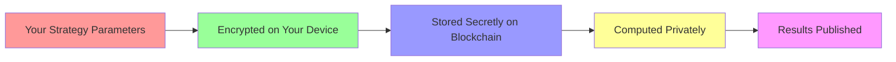
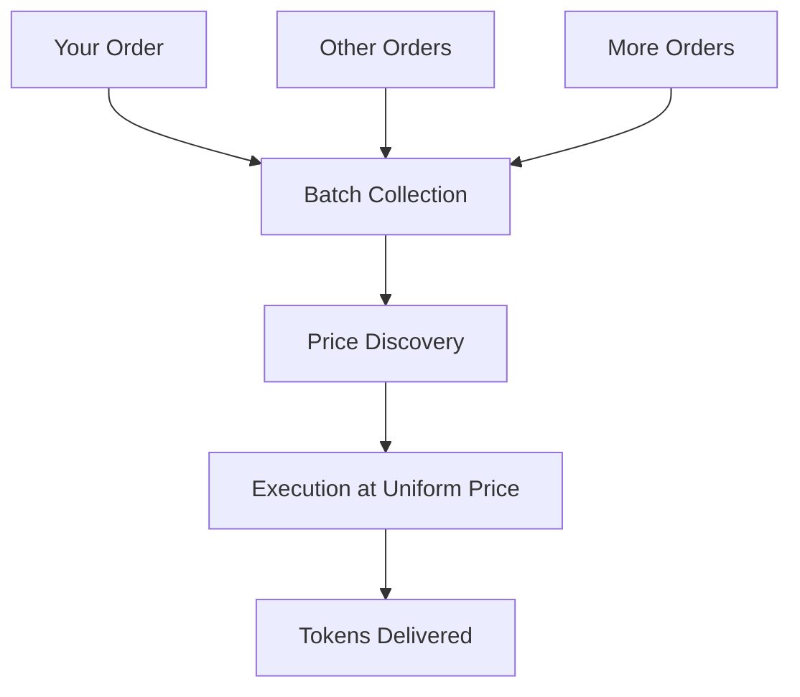

# Chimera Protocol - User Guide

## 🎯 Welcome to the Future of Confidential DeFi

Chimera Protocol is the world's first confidential automated market maker (AMM) that lets you create, trade, and manage sophisticated financial strategies while keeping your intellectual property secret.

---

## 📋 Table of Contents

1. [Getting Started](#1-getting-started)
2. [Understanding Chimera](#2-understanding-chimera)
3. [Creating Strategies](#3-creating-strategies)
4. [Dark Pool Trading](#4-dark-pool-trading)
5. [Portfolio Management](#5-portfolio-management)
6. [Advanced Features](#6-advanced-features)
7. [FAQ](#7-faq)
8. [Support](#8-support)

---

## 1. Getting Started

### 1.1 What You Need

- **Wallet**: MetaMask or any Web3-compatible wallet
- **Tokens**: FHE tokens for Fhenix network gas fees
- **Capital**: Tokens you want to trade or provide liquidity with

### 1.2 Connecting to Chimera

#### Step 1: Add Fhenix Network

**Automatic Setup:**
1. Visit [app.chimera.finance](https://app.chimera.finance)
2. Click "Connect Wallet"
3. Click "Add Fhenix Network" when prompted
4. Approve network addition in your wallet

**Manual Setup:**
```
Network Name: Fhenix Helium
RPC URL: https://api.helium.fhenix.zone
Chain ID: 8008135
Currency Symbol: FHE
Block Explorer: https://explorer.helium.fhenix.zone
```

#### Step 2: Get Test Tokens

1. Visit the [Fhenix Faucet](https://faucet.helium.fhenix.zone)
2. Enter your wallet address
3. Request test FHE tokens
4. Wait for tokens to arrive (usually 1-2 minutes)

#### Step 3: Connect Your Wallet

1. Go to [app.chimera.finance](https://app.chimera.finance)
2. Click "Connect Wallet"
3. Select your wallet provider
4. Approve the connection
5. You're ready to use Chimera! 🎉

### 1.3 Interface Overview

```
┌─────────────────────────────────────────────────────┐
│ 🏠 Dashboard    📊 Strategies    🌑 Dark Pool     │
│                                                     │
│ ┌─────────────┐ ┌─────────────┐ ┌─────────────┐    │
│ │ My          │ │ Active      │ │ Portfolio   │    │
│ │ Strategies  │ │ Orders      │ │ Balance     │    │
│ │             │ │             │ │             │    │
│ │ 🎯 3 Active │ │ 🌑 2 Open   │ │ 💰 $10,500  │    │
│ └─────────────┘ └─────────────┘ └─────────────┘    │
│                                                     │
│ 📈 Performance Chart                               │
│ ┌─────────────────────────────────────────────────┐ │
│ │           📊 Your Performance                   │ │
│ │    ╭─╮                                         │ │
│ │   ╱   ╲     ╭─╮                                │ │
│ │  ╱     ╲   ╱   ╲                               │ │
│ │ ╱       ╲_╱     ╲                              │ │
│ └─────────────────────────────────────────────────┘ │
└─────────────────────────────────────────────────────┘
```

---

## 2. Understanding Chimera

### 2.1 What Makes Chimera Special?

#### 🔐 **Privacy First**
Unlike other DeFi protocols where everything is public, Chimera keeps your strategy secrets protected using advanced encryption.

#### 🌑 **MEV Protection**
Your trades are processed in confidential batches, preventing front-running and sandwich attacks.

#### 📊 **Sophisticated Strategies**
Create complex financial products using programmable bonding curves that were previously only available to institutions.

### 2.2 Core Components Explained

#### 🎯 **Custom Strategies**
Create pools with secret parameters that determine how prices move:
- **Linear**: Steady price changes with configurable slope and intercept
- **Exponential**: Accelerating growth patterns with momentum adjustments
- **Sigmoid**: Bounded growth (perfect for options) with automatic bounds
- **Logarithmic**: Diminishing returns curves with minimum liquidity protection
- **Polynomial**: Complex multi-factor relationships with domain validation
- **Smart Liquidity**: Automatic adjustments based on curve type and market conditions
- **Dynamic Fees**: Volatility-based fee adjustments for optimal pricing

#### 🌑 **Dark Pool Trading**
Submit encrypted trading orders that get processed fairly:
- Your trade details stay secret until execution
- All orders in a batch get the same price
- No MEV exploitation or front-running

#### 🧩 **Portfolio Weaver** *(Coming Soon)*
Create diversified portfolios with hidden allocations:
- Asset weights stay confidential
- Automated rebalancing
- Professional-grade portfolio management

### 2.3 How Encryption Works



**You Control Your Secrets:**
- Parameters encrypted in your browser before sending
- Only you have the decryption keys
- Blockchain computes on encrypted data
- Strategy logic remains completely private

---

## 3. Creating Strategies

### 3.1 Your First Strategy

Let's create a simple linear pricing strategy for an ETH/USDC pool.

#### Step 1: Navigate to Strategy Creator

1. Go to the **Strategies** tab
2. Click **"Create New Strategy"**
3. Select **"Linear Curve"** as your strategy type

#### Step 2: Configure Your Strategy

**Basic Settings:**
```
Strategy Type: Linear Curve
Token A: ETH
Token B: USDC
Fee Tier: 0.3%
```

**Strategy Parameters:**
```
Slope: 1000        (How fast price changes)
Intercept: 2000    (Base price level)
Max Leverage: 5x   (Risk limit)
Volatility: 1%     (Price adjustment factor)
```

#### Step 3: Understand the Parameters

- **Slope (1000)**: For every 1 ETH traded, price changes by 0.001 USDC
- **Intercept (2000)**: Base price starts at 2000 USDC per ETH
- **Max Leverage (5x)**: Positions can't exceed 5x leverage
- **Volatility (1%)**: Price adjusts by 1% based on market volatility

#### Step 4: Review and Deploy

1. Review your parameters (they'll be encrypted)
2. Click **"Encrypt Parameters"** - this happens in your browser
3. Click **"Deploy Strategy"**
4. Approve the transaction in your wallet
5. Wait for confirmation (usually 30-60 seconds)

**🎉 Congratulations! You've created your first confidential strategy!**

### 3.2 Advanced Strategy Types

#### 🚀 Exponential Growth Strategy

Perfect for capturing momentum in trending markets:

```
Strategy Type: Exponential Curve
Base Multiplier: 100
Growth Rate: 5 (0.005 scaled)
Offset: 50
Max Leverage: 10x
```

**Use Case**: Altcoin trading where you expect exponential growth phases.

#### 📈 Sigmoid Options Strategy

Ideal for creating bounded options-like products:

```
Strategy Type: Sigmoid Curve
Maximum Value: 200
Steepness: 15
Midpoint: 100
Offset: 20
Max Leverage: 20x
```

**Use Case**: Creating call/put options with natural price bounds.

#### 📊 Logarithmic Yield Strategy

Great for yield farming with diminishing returns:

```
Strategy Type: Logarithmic Curve
Multiplier: 500
Offset: 1000
Max Leverage: 3x
```

**Use Case**: Stable yield generation with risk management.

### 3.3 Strategy Management

#### Monitoring Performance

```
📊 Strategy Dashboard
┌─────────────────────────────────────────┐
│ Strategy: ETH/USDC Linear #1            │
│ Status: 🟢 Active                       │
│ TVL: $45,000                           │
│ 24h Volume: $12,000                    │
│ Your Fees: $45.67                     │
│ ROI: +12.3%                           │
│                                        │
│ [View Details] [Update] [Pause]        │
└─────────────────────────────────────────┘
```

#### Updating Parameters

1. Go to **"My Strategies"**
2. Click on your strategy
3. Click **"Update Parameters"**
4. Modify your encrypted parameters
5. Submit update transaction

**Note**: Updates may require a waiting period for security.

#### Pausing Strategies

If you need to stop your strategy temporarily:

1. Click **"Pause Strategy"**
2. Existing positions remain open
3. New trading is disabled
4. You can unpause anytime

---

## 4. Dark Pool Trading

### 4.1 What is Dark Pool Trading?

Dark pools are private trading venues where your orders are hidden from other traders until execution. This prevents:

- **Front-running**: Others can't see your order and trade ahead of you
- **Sandwich attacks**: Manipulators can't bracket your trade
- **Price impact**: Large orders don't move the market before execution

### 4.2 Submitting Your First Dark Pool Order

#### Step 1: Navigate to Dark Pool

1. Click on the **"Dark Pool"** tab
2. Select your trading pair (e.g., ETH/USDC)
3. Choose **"Submit Order"**

#### Step 2: Configure Your Order

```
┌─────────────────────────────────────────┐
│ 🌑 Dark Pool Order                      │
│                                         │
│ From: ETH                              │
│ To: USDC                               │
│                                         │
│ Amount In: 10.0 ETH                    │
│ Min Amount Out: 18,500 USDC            │
│ Max Slippage: 0.5%                     │
│ Deadline: 1 hour                       │
│                                         │
│ Order Type: Market                      │
│                                         │
│ [Encrypt & Submit Order]                │
└─────────────────────────────────────────┘
```

#### Step 3: Order Encryption

When you click **"Encrypt & Submit Order"**:

1. Your browser encrypts all order details
2. Encrypted order is sent to the dark pool
3. Your order joins the next batch
4. Details remain hidden until execution

#### Step 4: Batch Execution



**What Happens:**
- Orders collect for 5 minutes (or until 100 orders)
- System calculates fair uniform price for all orders
- All orders execute at the same price
- You receive your tokens automatically

### 4.3 Order Types Explained

#### 🎯 **Market Orders**
- Execute at current market conditions
- Fast execution (next batch)
- Price determined by batch

#### ⏰ **Limit Orders**
- Only execute if price meets your requirements
- May wait multiple batches
- More control over execution price

#### 🔄 **Time-weighted Orders**
- Spread execution over multiple batches
- Reduces market impact
- Better for large orders

### 4.4 Monitoring Your Orders

```
📋 My Dark Pool Orders
┌─────────────────────────────────────────┐
│ Order #1234                             │
│ Status: 🟡 Pending (Batch #567)        │
│ 10.0 ETH → Min 18,500 USDC             │
│ Submitted: 2 min ago                    │
│ Est. Execution: 3 min                   │
│                                         │
│ [Cancel Order] [View Details]           │
└─────────────────────────────────────────┘

┌─────────────────────────────────────────┐
│ Order #1233                             │
│ Status: ✅ Filled (Batch #566)          │
│ 5.0 ETH → 9,287 USDC                   │
│ Execution Price: 1,857.4 USDC/ETH      │
│ Filled: 5 min ago                       │
│                                         │
│ [View Receipt] [Trade Again]            │
└─────────────────────────────────────────┘
```

### 4.5 Dark Pool Benefits

#### 🛡️ **MEV Protection**
- **No Front-running**: Orders hidden until execution
- **No Sandwich Attacks**: Batch execution prevents manipulation
- **Fair Pricing**: Everyone gets the same price

#### 💰 **Better Execution**
- **Reduced Slippage**: Batch processing improves fills
- **Lower Fees**: Shared gas costs across batch
- **Price Improvement**: Often better than public DEXs

#### 🔒 **Privacy Protection**
- **Hidden Intentions**: Order details encrypted
- **Anonymous Trading**: Strategy patterns protected
- **Confidential Execution**: Trade size stays private

---

## 5. Portfolio Management

### 5.1 Creating Your First Portfolio

*Note: Portfolio Weaver is launching soon. Here's what to expect:*

#### Step 1: Portfolio Setup

```
🧩 Create ZK-Portfolio
┌─────────────────────────────────────────┐
│ Portfolio Name: Balanced Growth         │
│ Management Style: Conservative          │
│                                         │
│ Assets & Weights:                       │
│ • ETH: 40% (Hidden)                    │
│ • BTC: 30% (Hidden)                    │
│ • USDC: 20% (Hidden)                   │
│ • Strategy Token: 10% (Hidden)         │
│                                         │
│ Rebalance Threshold: 5%                │
│ Management Fee: 1% annually            │
│                                         │
│ [Encrypt & Create Portfolio]            │
└─────────────────────────────────────────┘
```

#### Step 2: Private Allocation

Your asset weights are encrypted, so:
- ✅ Portfolio composition stays secret
- ✅ Rebalancing strategy hidden
- ✅ Performance metrics confidential
- ✅ Only you know the actual allocations

#### Step 3: Automated Management

The portfolio automatically:
- Monitors asset weights continuously
- Rebalances when threshold is exceeded
- Executes trades through dark pool
- Compounds returns efficiently

### 5.2 Portfolio Types

#### 🛡️ **Conservative Growth**
```
Target Allocation:
• Stablecoins: 50%
• ETH: 30%
• Blue-chip DeFi: 20%

Characteristics:
• Low volatility
• Steady returns
• Capital preservation
```

#### 🚀 **Aggressive Growth**
```
Target Allocation:
• Alt-coins: 40%
• ETH: 30%
• Leveraged positions: 20%
• Options strategies: 10%

Characteristics:
• High potential returns
• Higher volatility
• Active rebalancing
```

#### ⚖️ **Market Neutral**
```
Target Allocation:
• Long positions: 50%
• Short positions: 50%

Characteristics:
• Market direction independent
• Alpha generation focus
• Lower correlation to market
```

### 5.3 Performance Tracking

```
📊 Portfolio Performance (Private View)
┌─────────────────────────────────────────┐
│ Total Value: $50,000 (+12.3%)          │
│ 24h Change: +$560 (+1.1%)              │
│ 7d Change: +$2,100 (+4.4%)             │
│ Monthly: +$4,800 (+10.6%)              │
│                                         │
│ Asset Performance (Your Eyes Only):     │
│ • Asset A: +15.2% (weight: hidden)     │
│ • Asset B: +8.7% (weight: hidden)      │
│ • Asset C: +22.1% (weight: hidden)     │
│ • Asset D: -2.3% (weight: hidden)      │
│                                         │
│ Next Rebalance: In 2 days              │
│ [Manual Rebalance] [Update Strategy]    │
└─────────────────────────────────────────┘
```

**Privacy Features:**
- Only you can see detailed allocations
- Others see only total portfolio value
- Rebalancing transactions look random
- Strategy logic remains confidential

---

## 6. Advanced Features

### 6.1 Strategy Composition

#### Combining Multiple Strategies

Create sophisticated strategies by combining different curve types:

```
🎯 Multi-Curve Strategy
┌─────────────────────────────────────────┐
│ Base Layer: Linear (70% allocation)     │
│ • Stable price discovery               │
│ • Low risk foundation                  │
│                                        │
│ Growth Layer: Exponential (20%)        │
│ • Momentum capture                     │
│ • Higher returns                       │
│                                        │
│ Options Layer: Sigmoid (10%)           │
│ • Downside protection                  │
│ • Bounded risk                        │
│                                        │
│ [Deploy Multi-Strategy]                │
└─────────────────────────────────────────┘
```

### 6.2 Risk Management

#### Built-in Protection

**Automatic Risk Controls:**
- **Leverage Limits**: Set maximum position sizes
- **Volatility Caps**: Automatic position reduction in volatile markets
- **Time Decay**: Built-in option expiration mechanics
- **Circuit Breakers**: Emergency pause functionality

**Custom Risk Parameters:**
```
🛡️ Risk Settings
┌─────────────────────────────────────────┐
│ Max Position Size: $10,000             │
│ Stop Loss: -15%                        │
│ Take Profit: +25%                      │
│ Volatility Threshold: 50%              │
│ Time Decay Rate: 5% daily              │
│                                        │
│ Emergency Controls:                     │
│ ☑️ Auto-pause on anomalies             │
│ ☑️ Position size limits                │
│ ☑️ Liquidity requirements              │
│                                        │
│ [Update Risk Settings]                  │
└─────────────────────────────────────────┘
```

### 6.3 Analytics & Insights

#### Private Performance Analytics

```
📈 Strategy Analytics (Confidential)
┌─────────────────────────────────────────┐
│ Sharpe Ratio: 2.34                     │
│ Max Drawdown: -8.2%                    │
│ Win Rate: 67%                          │
│ Average Trade: +$127                   │
│                                        │
│ Volume Metrics:                         │
│ • Total Volume: $250,000               │
│ • Avg Daily Volume: $8,300             │
│ • Fee Revenue: $750                    │
│                                        │
│ Efficiency Metrics:                     │
│ • Gas Usage: Optimized                 │
│ • Slippage: 0.12% avg                 │
│ • MEV Protection: 100%                 │
│                                        │
│ [Export Report] [Share Insights]        │
└─────────────────────────────────────────┘
```

### 6.4 Social Features

#### Strategy Marketplace *(Coming Soon)*

**Discover Strategies:**
- Browse public strategy templates
- See performance without revealing parameters
- Follow top strategists
- Clone successful approaches

**Share Your Success:**
- Publish strategy templates
- Earn fees from strategy usage
- Build reputation as strategist
- Contribute to ecosystem

#### Collaborative Portfolios

**Pool Management:**
- Multiple managers with different permissions
- Encrypted decision-making processes
- Profit-sharing mechanisms
- Governance integration

---

## 7. FAQ

### 7.1 General Questions

#### Q: Is Chimera safe to use?

**A:** Yes! Chimera has multiple layers of security:
- Smart contracts audited by top security firms
- Fhenix encryption mathematically proven secure
- No single point of failure
- Emergency pause mechanisms
- Insurance fund protection *(coming soon)*

#### Q: How much does it cost to use Chimera?

**A:** Fee structure:
- **Strategy Creation**: One-time gas fee (~$10-50)
- **Trading Fees**: 0.1-0.3% per trade
- **Dark Pool**: 0.05% processing fee
- **Portfolio Management**: 1-2% annual fee

#### Q: Can others copy my strategies?

**A:** No! Your strategy parameters are encrypted using Fhenix's homomorphic encryption. Even with access to the blockchain data, others cannot see your secret parameters.

### 7.2 Technical Questions

#### Q: What happens if Fhenix network goes down?

**A:** Chimera has multiple fallback mechanisms:
- Cross-chain deployment planned
- Emergency mode with basic functionality
- Fund recovery procedures
- Decentralized governance for protocol upgrades

#### Q: How long do dark pool batches take?

**A:** Batch timing:
- **Standard**: 5 minutes or 100 orders
- **Fast Track**: 1 minute (higher fee)
- **Large Orders**: Special handling for $100k+ orders
- **Market Hours**: More frequent batches during high activity

#### Q: Can I cancel orders in the dark pool?

**A:** Yes, but with limitations:
- Cancel anytime before batch execution
- Partial fills cannot be cancelled
- Cancellation fee may apply
- Instant cancellation available for premium users

### 7.3 Strategy Questions

#### Q: Which curve type should I use?

**A:** Depends on your strategy:
- **Linear**: Steady markets, stable strategies
- **Exponential**: Growth momentum, trending markets
- **Sigmoid**: Options strategies, bounded risks
- **Logarithmic**: Yield farming, diminishing returns
- **Polynomial**: Complex relationships, advanced users

#### Q: How do I know if my strategy is performing well?

**A:** Key metrics to watch:
- **ROI vs Benchmark**: Compare to simple buy-and-hold
- **Sharpe Ratio**: Risk-adjusted returns
- **Volume Growth**: Increasing usage indicates success
- **Fee Revenue**: Direct profitability measure
- **Drawdown**: Maximum loss from peak

#### Q: Can I update my strategy parameters?

**A:** Yes, with restrictions:
- **Cooling Period**: 24-48 hours between updates
- **Governance Approval**: Major changes may require voting
- **Impact Assessment**: System checks for stability
- **Emergency Updates**: Instant updates for security fixes

### 7.4 Privacy Questions

#### Q: What data is visible to others?

**A:** Public information:
- Total portfolio value
- Number of strategies
- General trading activity
- Public addresses used

**Private information:**
- Strategy parameters
- Specific allocations
- Trade sizes and timing
- Performance breakdowns

#### Q: How does encryption work exactly?

**A:** Simplified explanation:
1. Your browser encrypts data before sending
2. Encrypted data stored on Fhenix blockchain
3. Computations happen on encrypted values
4. Only final results are revealed
5. Original parameters stay encrypted forever

#### Q: Can Chimera team see my strategies?

**A:** No! Even the Chimera team cannot see:
- Your strategy parameters
- Specific allocations
- Private performance data
- Trading patterns

We can only see aggregate, anonymized statistics.

---

## 8. Support

### 8.1 Getting Help

#### 📚 **Documentation**
- **User Guide**: You're reading it!
- **Developer Docs**: [docs.chimera.finance/dev](https://docs.chimera.finance/dev)
- **API Reference**: [docs.chimera.finance/api](https://docs.chimera.finance/api)
- **Video Tutorials**: [youtube.com/ChimeraProtocol](https://youtube.com/ChimeraProtocol)

#### 💬 **Community Support**
- **Discord**: [discord.gg/chimera](https://discord.gg/chimera)
  - General help and discussion
  - Strategy sharing (non-sensitive)
  - Community events and updates
  
- **Telegram**: [t.me/ChimeraProtocol](https://t.me/ChimeraProtocol)
  - Quick questions and support
  - Real-time price and market updates
  - Breaking news and announcements

#### 🎫 **Direct Support**
- **Support Tickets**: [support.chimera.finance](https://support.chimera.finance)
- **Email**: help@chimera.finance
- **Emergency**: emergency@chimera.finance (urgent issues only)

### 8.2 Tutorial Videos

#### 🎬 **Getting Started Series**
1. **"Your First Strategy"** (5 min)
   - Wallet setup and connection
   - Creating a simple linear strategy
   - Monitoring performance

2. **"Dark Pool Mastery"** (8 min)
   - Understanding MEV protection
   - Submitting confidential orders
   - Optimizing execution

3. **"Advanced Strategies"** (12 min)
   - Exponential and sigmoid curves
   - Risk management settings
   - Performance optimization

#### 🎓 **Deep Dive Workshops**
- **"Options Strategies with Sigmoid Curves"** (30 min)
- **"Yield Farming with Logarithmic Functions"** (25 min)
- **"Portfolio Theory for DeFi"** (45 min)

### 8.3 Community Resources

#### 🧠 **Strategy Library**
Browse community-shared strategy templates:
- Conservative income strategies
- Growth momentum strategies
- Market-neutral approaches
- Exotic derivatives strategies

#### 📊 **Performance Leaderboards**
Compare your performance (anonymously):
- Top strategies by return
- Most efficient gas usage
- Highest volume strategies
- Best risk-adjusted returns

#### 🏆 **Community Challenges**
Participate in strategy competitions:
- Monthly trading challenges
- Risk management contests
- Innovation competitions
- Bug bounty programs

### 8.4 Feedback & Suggestions

We're constantly improving Chimera based on user feedback:

**Feature Requests:**
- Submit ideas at [feedback.chimera.finance](https://feedback.chimera.finance)
- Vote on proposed features
- Track development progress
- Get updates on implementation

**Bug Reports:**
- Use [github.com/ChimeraProtocol/issues](https://github.com/ChimeraProtocol/issues)
- Include detailed reproduction steps
- Screenshots or videos helpful
- Rewards for critical bug discoveries

**General Feedback:**
- User experience improvements
- Documentation suggestions
- Interface design feedback
- Performance optimization ideas

---

## 🎉 Ready to Start?

Congratulations! You now understand how to use Chimera Protocol to:

✅ **Create confidential strategies** that protect your intellectual property  
✅ **Trade without MEV** using our dark pool technology  
✅ **Manage sophisticated portfolios** with professional-grade tools  
✅ **Access institutional features** previously unavailable in DeFi  

### Next Steps:

1. **[Connect Your Wallet](https://app.chimera.finance)** and get started
2. **Join Our Community** on [Discord](https://discord.gg/chimera)
3. **Create Your First Strategy** using the simple tutorial
4. **Explore Advanced Features** as you gain experience
5. **Share Your Success** with the community (while keeping secrets secret!)

---

**Welcome to the future of confidential DeFi! 🚀**

*Remember: With great privacy comes great responsibility. Always understand the risks and trade responsibly.*

---

*Last updated: 2024 | Version 1.0*
